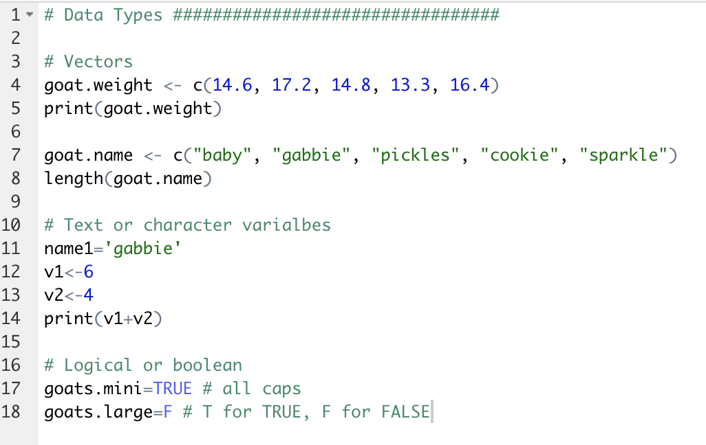
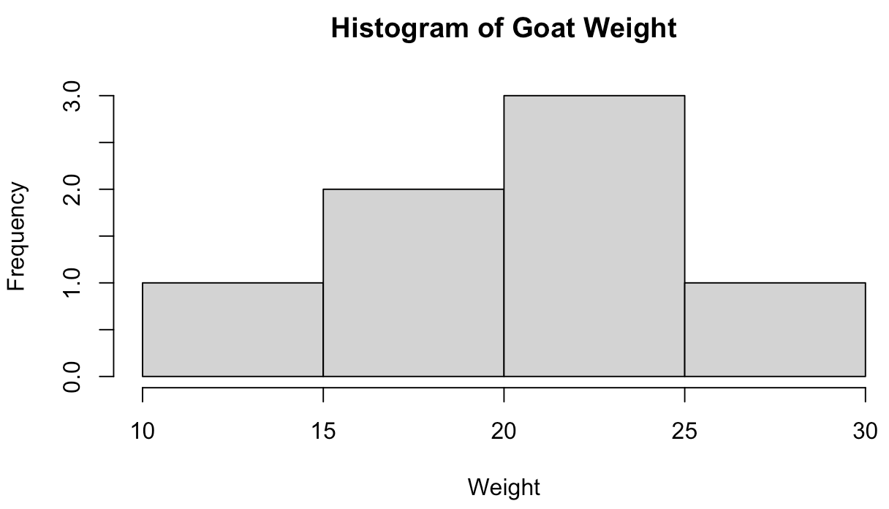
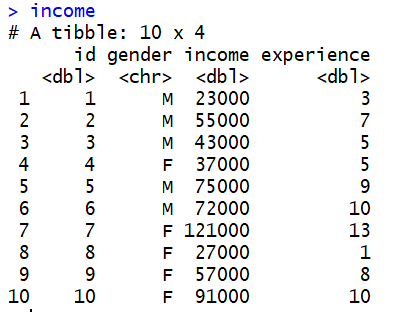
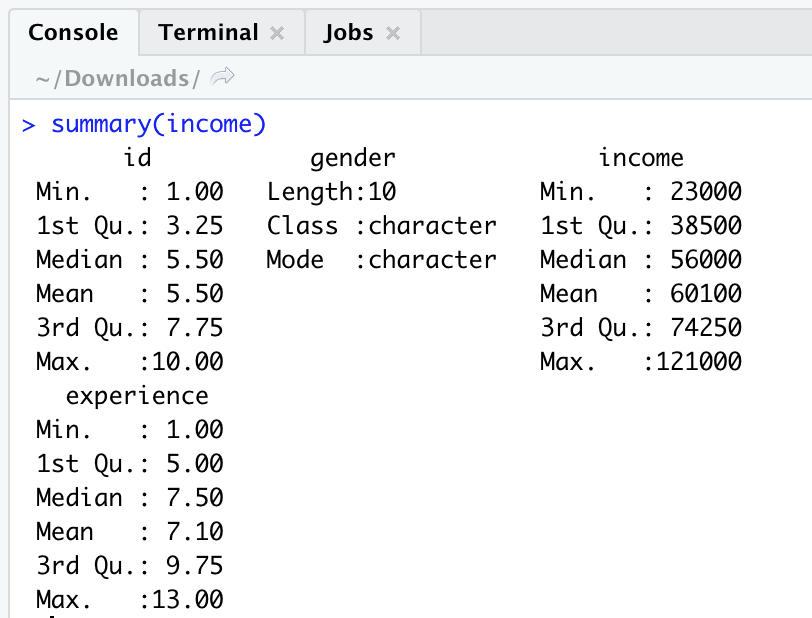
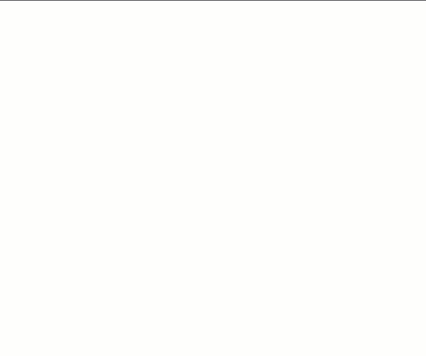

 
# Data types, Basic commands & Charting
If you have any questions or get stuck as you work through this in-class exercise, please ask the instructor for assistance.  Have fun!

1. **Getting familiar with the RStudio Interface**
- If you haven’t already, install both R & R-Studio on your laptop: 
    - [Mac R download](https://cran.r-project.org/bin/macosx/){:target="_blank"}
    - [Windows R download](https://cran.r-project.org/bin/windows/base/){:target="_blank"}
    - [R-Studio Desktop (Mac & Windows)](https://www.rstudio.com/products/rstudio/download/){:target="_blank"}
  
- Open RStudio and get familiar with the interface by finding 4 windows
- In the console in the bottom left window type: help(mean) and then press enter on your keyboard. 
    - This will provide you with information about the mean function in RStudio. The help information will be displayed in the bottom right window.

2. **Data types and entering data**
- Create a new RScript by selecting the **File** menu then **New File** and then **R script**.

- Vectors (lists of numbers or text): 
    - In the Code Editor or script window (top left), enter miniature goat weight data into a vector by typing: **goat.weight <- c(14.6, 17.2, 14.8, 13.3, 16.4)** 
    - Press **cmd + enter** on a Mac, or **control + enter** on Windows to execute the line.
    
    - Note that the command you just ran magically appeared in your console in the bottom left window, and the values from the goat.weight vector appeared in your top right window. 
   
    - Type print **(goat.weight)** to print the contents of the vector in the console (bottom left window).
    - Copy, paste and run this command: **goat.name <- c("baby", "gabbie", "pickles", "cookie", "sparkle")**
    - Type or copy & paste, **length(goat.name)** and then run in order to count the number of goat names in the vector. 
 
- Variables (text and numeric):
    - Type **name1='gabbie'** then run.
    - Type **v1<-6** then run.
    - Type **v2<-4** then run.
    - Type **print(v1+v2)** and then run. The result in the console on the bottom left will be 10 of course. 
     
- Logical or boolean values: 
    - Type goats.mini=TRUE and goats.large=F . T is short for TRUE and F is short for FALSE. These variables should also appear in the top right window. 
     
- Display all objects you have created by typing the following into the bottom left console window and pressing enter: **ls()** (Please note that “**l**” is a letter) 

- Save your script by clicking on the top menu bar: **File -> Save**
- Remove the “name1” object by typing in the console: **rm(name1)** 
 
- Remove all variables and objects by typing the following in the console: **rm(list=ls())** 
 
3. **Descriptive Statistics**
- Input data with this command: **goat.weight<-c(22, 27, 19, 25, 12, 22, 18)**
- Mean: If you want to find the average or mean of goat.weight, you can enter the command **mean(goat.weight)** in the console window. This should return 20.71429
- Median: Similarly for the median enter the command **median(goat.weight)**. Answer: 22
- Summary: You can also use the summary command to generate several descriptive statistics at the same time: **summary(goat.weight)** 
- Standard deviation: enter: **sd(goat.weight)**  Answer: 4.956958

4. **Histogram Plot for goat data**
- Histograms can be created using the hist() function. This function takes in a vector of values for which the histogram is plotted.
- Enter **hist(goat.weight)** in the command line. The histogram will appear to the right.
- We can also pass in additional parameters to control the way our plot looks. Some of the frequently used ones are main to give the title, **xlab** and **ylab** to provide labels for the axes. 
- Enter **hist(goat.weight,main='Histogram of Goat Weight',xlab='Weight')** 

5. **Read or Import an Excel spreadsheet into R-Studio**  
- [Download and save the following Excel spreadsheet](https://bit.ly/dsc-rstudio-excel-1){:target="_blank"} 
Note: Please remember where the income.xls file is saved (usually in a “downloads” or “desktop” folder).
- Import the dataset by clicking **File -> Import dataset -> From Excel** and click **Yes** to install the “**readxl**” package.
- Click Browse to find the excel file. Select the **income.xlsx** file, and then **Open**. Now click **Import**.

- List the whole dataset in the console by typing: **income** 

- Calculate the descriptive statistics for the income dataset by typing in the console: **summary(income)**

6. **Histogram plot**
- Histograms can be created using the hist() function. This function takes in a vector of values for which the histogram is plotted.
- Enter **hist(income$experience)** in the command line. The histogram will appear to the right.
- You can see there is a histogram plot coming out in the plot window. We can see that there are 7 cells with equally spaced breaks. In this case, the height of a cell is equal to the number of observations falling in that cell.
- We can also pass in additional parameters to control the way our plot looks. Some of the frequently used ones are **main** to give the title, **xlab** and **ylab** to provide labels for the axes. 
- Enter **hist(income$experience,main='Histogram of Experience',xlab='Experience')** 

[NEXT STEP: Tidyverse and Data Manipulation](tidyverse-data.html){: .btn .btn-blue }
