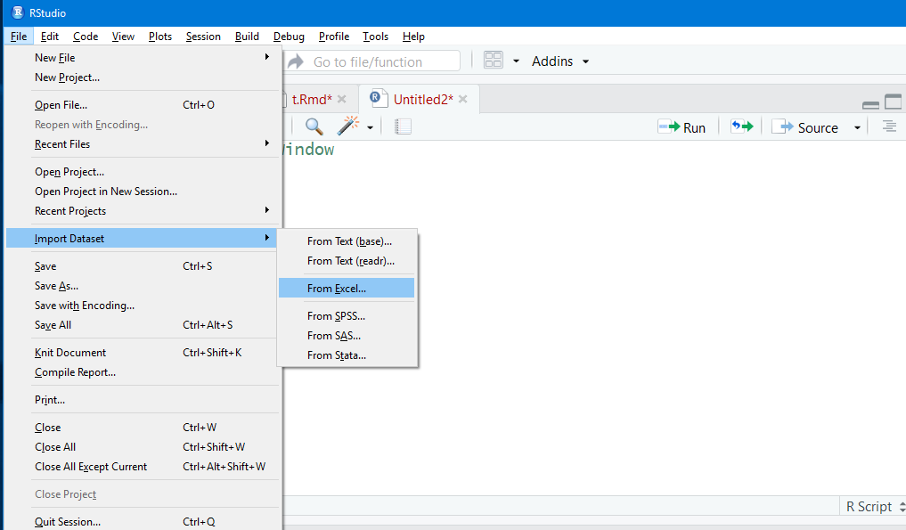
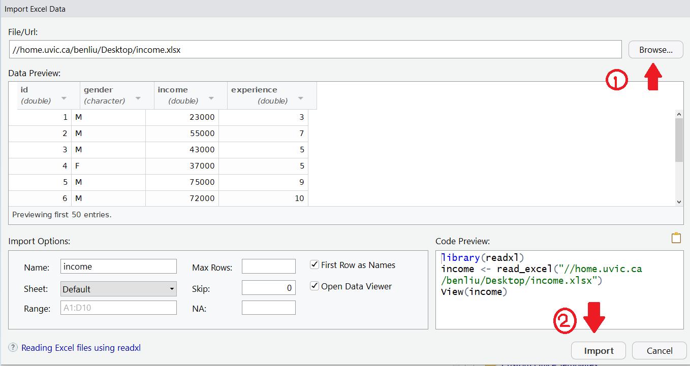

 
# Data types and Basic commands
## SKIP THIS EXERCISE IF YOU ALREADY COMPLETED EXERCISE 0
If you and your group have any questions or get stuck as you work through this in-class exercise, please ask the instructor for assistance.  Have fun!

1. **Getting familiar with RStudio** 
- If you haven’t already, download and install R & R-Studio: 
    - [R](http://cran.stat.sfu.ca/)
    - [R-Studio Desktop](https://www.rstudio.com/products/rstudio/download/)
- Open RStudio and get familiar with the interface by finding 4 windows
    - In the console window (left), type **getwd()** to display the current working directory.
    - This directory should contain all the datasets you plan on using.
    - Set the working directory to your preferred location using. For e.g.: **setwd("c:/Users/rmccue/Download")**
- Type: **help(mean)** to get help about the mean function & see use case examples. 

2. **Data types and basic commands**
- To start with, click the ‘File’ on the menu and then create a new R script.
- Variables: “ <- ”(read as get) and “ =” can be used to assign a value to a variable. Type **v1<-1**  and **v2=2**  in the **script window** and press **cmd + enter** for MacOS or **control +** enter for Windows to execute the line. 
- Characters: Type **c1='c'**  and **c2='good'**.
- Logical or boolean values: Type **b1=TRUE** and **b2=T** . T is short for TRUE and F is short for FALSE.
- Vectors: Type **x1=c(1,2,3)** and **x2=1:3** ( c stands for combine / concatenate). Try the following steps in the picture to explore other ways of building vectors.
- 
- Matrix: Type **m1=matrix(data = c(1,2,3,4,5,6), nrow=2)** and **m2=matrix(data = c(1,2,3,4,5,6)**, **ncol=2, byrow=TRUE)**. Byrow is set to FALSE by default which means the matrix is filled by columns. Double click on **m1** and **m2** in **Environment window** to see their values. Try the following steps in the picture to explore how to access elements in a matrix.
- Display all objects created (by assigning values) by typing the following into the **console window**: ls() (Please note that “l” is the letter)
- Save your script by clicking on the top menu bar: “File” -> “Save”
- Remove the “m1” object by typing in the console: **rm(m1)**
- Remove all the objects by typing the following in the console: **rm(list=ls())**

3. **Read or Import an Excel data file into R-Studio**
- Open [this web page](https://goo.gl/68W45s){:target="_blank"}
	  - Note: Click “No, thanks. Continue to review” at the bottom if you don’t have a dropbox account. Next click on the “Download” button in the top right of the web page, and then “Direct download”. Please take note of where the income.csv file is saved (usually in a “downloads” or “desktop” folder).
- Import the dataset by clicking “File -> Import dataset -> From Excel” and click “Yes” to install the “readxl” package

- Click “Browse” to find the excel file and click “Import”
- 
- List the whole dataset in the console: **income** because income is the name of the dataset you imported.
- List the objects contained in your workspace in the console: **ls()**
- List the variables contained in the data frame in the console: **names(income)**
- List the variable “**experience**” in the console: **income$experience**
- Attach your data frame in the console (so you don’t have to type the name of the dataset when calling the variables contained in the dataset):
    - **attach(income)**
    -   
    - List all the values for the variable “**experience**” by typing directly into the console: 
    - **experience**
! [Demonstration of step 3](images/rstudio-basics-08.gif)
- Calculate the descriptive statistics for the income dataset in the console: **summary(income)**

[NEXT STEP: Tidyverse and Data Manipulation](tidyverse-data.html){: .btn .btn-blue }
