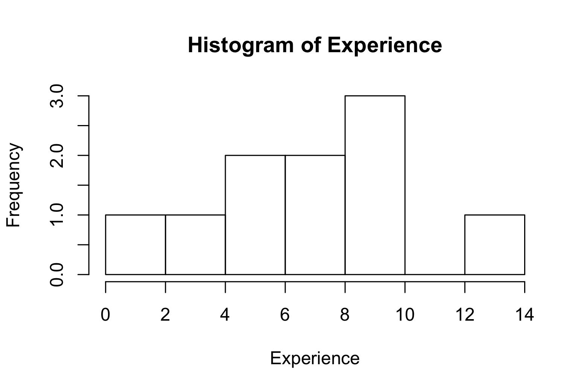

4 - Basic Data Analysis
================

- [1 Importing data into R](#1-importing-data-into-r)
  - [1.1 Working directory](#11-working-directory)
  - [1.2 Importing tabular data](#12-importing-tabular-data)
- [2 Data frames](#2-data-frames)
- [3 Summary statistics](#3-summary-statistics)
- [4 Histograms](#4-histograms)


<br>

So far, we have created our own objects by manually entering all of the data in the console. In this section, we will learn how to create objects by importing (aka ‘reading’) data (compiled outside of R) into R, perform basic statistics on it, and visualize it with a histogram.

## 1. Importing data into R

### 1.1. Working directory

Before importing your data into R, it is important to understand what the working directory is. The **working directory** is the location on your computer (i.e., the folder) where R looks for files when importing data and where it saves files. You typically want to have all the files related to a single project in the same folder, so that R can easily find them, and you know where they are saved.

You can check the path of your working directory by running the function `getwd()` in the console.

<div class="task-box" markdown="1">
  
⭐ <u>Task 4-1</u>

**Check your working directory.**

Type in `getwd()` in the console and hit enter.

{::options parse_block_html='true' /}
<details>
<summary>
Check your code
</summary>

``` r
getwd()
```
  ## [1] "A Path to a Folder"

You will get a path to a folder on your computer. This is your current working directory.
  
</details>

{::options parse_block_html='false'/}

</div>

More often than not, you will want to change your working directory to a specific folder rather than the default folder. To do that, you can use the `setwd()` function. Inside the parentheses (i.e. as the function parameter), you should type the path to the folder between quotes. For example, let's assume you want your working directory to be a folder called "my_project" that is in the main Documents folder. You would type:

```
setwd("C:/Documents/my_project")
```
<div class="task-box" markdown="1">
  
⭐ <u>Task 4-2</u>

**Change your working directory.**

Change your working directory to a folder where you will keep all the files related to this workshop. Note: You should use forward slashes to denote the path to your folder. This should work on both Mac and Windows.

{::options parse_block_html='true' /}
<details>
<summary>
Check your code
</summary>

``` r
setwd("Path to Folder")
```  
</details>

{::options parse_block_html='false'/}

</div>

If you are working alone on your scripts, always on the same computer, it is good practice to start every script by setting the working directory using `setwd()`. However, once you start collaborating with others, the path to the folders can be different between computers. At that point, you might want to learn about R Projects, which makes all paths relative to a pre-specified project working directory. You can read more about it [here](https://intro2r.com/work-d.html){:target="\blank"}.

### 1.2. Importing tabular data

R can handle multiple file types:

- .csv (comma-separated values)
- Excel (.xls, .xlsx)
- .txt (and .tsv - tab-separated values)
- .json (used for nested data structures)
  - These would likely be arrays of more than 2 dimensions.
- SPSS (another specialized statistics software)
- Data scraped from the web or via an API.

<div class="task-box" markdown="1">

⭐ <u>Task 1-1</u>

**Download data.**

Download and save [this Excel spreadsheet of Income
data](docs/income.xlsx){:target=“\_blank”}

- *Note:* Please remember where the income.xlsx file is saved (usually
  in a “downloads” or “desktop” folder).

</div>

<div class="task-box" markdown="1">

⭐ <u>Task 1-2</u>

**Import data.**

Import the dataset of Income data

- From the top menu bar, select…
- File
- Import dataset
- From Excel
- In the ‘Import Excel Data’ window select your file by:
- Entering the file path to the income.xlsx file you just downloaded.
- Selecting “Browse” on the right side of the path bar and locating it
  in the browser.
- Under ‘Import Options,’ make sure ‘Name’ is the same text as you wish
  for the variable to be named. Ours will be ‘income’.
- Click “Import”
- If asked to install the `readxl` package, click **Yes**.

</div>

Don’t worry about making a mistake importing this data. You can always
remove it using the `rm()` function.

Browse and import menu and buttons <br>


<br> Import excel data window


<br>

What you just imported is now stored as a ‘data frame’ object whose name
is `income`.

## 2. Data frames

**Definition - Data frame:** essentially a table. It is 2-dimensional
object that can hold different types of data types.

<details>
<summary>
More about Data frames
</summary>
Data frames contain information about a set of objects (e.g.,
cats).<br> - The data frame will contain one or more columns and one or
more rows.<br> - One column contains related values (column 1 = age,
column 2 = eye color).<br> - Because the column contains the same type
of information, it is equivalent to a vector. <br> - i.e., the ‘eye
color’ column will contain characters, not numbers.<br> - One row
denotes one object from the set. In a data frame of information about a
set of cats, each row is information about one specific cats.
</details>

A row can contain many different bits of information, like age
(numerical), eye color (character), breed (character), whether or not
it’s spayed/neutered (boolean). Because rows may contain values of
different types, one row would most likely not be a vector. It would
likely be a list, which can contain values of different types.

To see the data in our data frame, simply enter the name of the data
frame in the console and type ‘enter’ or ‘return’.

{::options parse_block_html='true' /}
<details>
<summary>
Check your code
</summary>

``` r
income
```

</details>

{::options parse_block_html='false'/}

<br>

The following will be the output:

    ## # A tibble: 10 × 4
    ##       id gender income experience
    ##    <dbl> <chr>   <dbl>      <dbl>
    ##  1     1 M       23000          3
    ##  2     2 M       55000          7
    ##  3     3 M       43000          5
    ##  4     4 F       37000          5
    ##  5     5 M       75000          9
    ##  6     6 M       72000         10
    ##  7     7 F      121000         13
    ##  8     8 F       27000          1
    ##  9     9 F       57000          8
    ## 10    10 F       91000         10

We will explore other ways to view and preview content of our data
frames in Activity 3.

**Note:** `<char>` stands for “character” data type and `<dbl>` stands
for “double-precision floating point numbers data” type. <br>

We can see now that our data frame `income` contains 10 objects (rows),
and 4 variables (columns)

- It can be inferred that this data relates to 10 people
- The variables measured with each person are:
  - id (in lieu of a name) (dbl)
  - gender (char)
  - income (dbl)
  - experience (dbl) <br>

<div class="task-box" markdown="1">

⭐ <u>Task 1-3</u>

## 3. Summary statistics.

Statistics is:

- the science of collecting, analyzing, and interpreting

- data to uncover patterns and trends,

- and inform decisions based on this data.

If you’re unfamiliar with statistics, you can learn more about it from
the [w3school Statistics
Tutorial](https://www.w3schools.com/statistics/index.php){:target=“\_blank”}

In this section, we’ll be focusing on

- Basic statistical measures
- Presenting data in a histogram
- More on presenting data will be covered in [Activity 4-Data
  Visualization](https://uviclibraries.github.io/rstudio/ggplot2-data.html){:target=“\_blank”}
- Importing data

### 3.1 Basic statistical measures

The function names for the following three statistical measures (mean,
median, standard deviation) are quite intuitive.

It is just the name or abbreviation of the statistical measure, where
the argument is the object containing the set of values we are
analyzing.

Each function takes the vector containing the values of the variable as 
its argument.

These three functions are designed for sets of numerical and integer
data types. If run on other types (character, aka text, and boolean, aka
true/false), result will be `NA`.

<div class="task-box" markdown="1">

⭐ <u>Task 4.3-1</u>

**Create a variable to be summarised.**

For this task, we will use a new vector object containing weights for a
set of pigs.

Create a vector object with the weights of a set of pigs. Name your
variable ‘pigs.weight’

`Weights of pigs: 22, 27, 19, 25, 12, 22, 18`

{::options parse_block_html='true' /}
<details>
<summary>
Check your code
</summary>

``` r
pigs.weight <- c(22, 27, 19, 25, 12, 22, 18)
```

</details>

{::options parse_block_html='false'/}

</div>

<br>

<div class="task-box" markdown="1">

⭐ <u>Task 2.1-2</u>

**Get the mean (average) value.**

**Mean:** the average value in a set.

The `mean()` function calculates the sum of the values in the set and 
divides the sum by the number of items in the set.

Write and execute a command that outputs the mean value of the pigs’
weights.

{::options parse_block_html='true' /}
<details>
<summary>
Check your code
</summary>

``` r
# output the average weight of all of the pigs
mean(pigs.weight)
```

    ## [1] 20.71429

</details>

{::options parse_block_html='false'/}

</div>

<br>

<div class="task-box" markdown="1">

⭐ <u>Task 2.1-3</u>

**Get median value.**

Write and execute a command that outputs the median value of the pigs’
weights

**Median:** The middle value in a sorted set (e.g. lowest - highest).
`median()`

{::options parse_block_html='true' /}
<details>
<summary>
Check your code
</summary>

``` r
median(pigs.weight)
```

    ## [1] 22

</details>

{::options parse_block_html='false'/}

</div>

<br> The output tells you the weight of the pig that falls between the
lighter half and the heavier half of the pigs. <br>

<br>

<div class="task-box" markdown="1">

⭐ <u>Task 2.1-4</u>

**Get standard deviation.**

**Standard deviation:** Describes how spread out the data is. 

The function in R is `sd()`

Write and execute a command that outputs the standard deviation of the
pigs’ weights

The output tells you how much the weights of the pigs vary from the
average weight.

- A small standard deviation means that most pigs’ weights are close to
  the average, indicating uniformity in size.
- A large standard deviation suggests a wide range of weights. <br>

{::options parse_block_html='true' /}
<details>
<summary>
Check your code
</summary>

``` r
sd(pigs.weight)
```

    ## [1] 4.956958

</details>

{::options parse_block_html='false'/}

</div>

<br>

<div class="task-box" markdown="1">

⭐ <u>Task 2.1-5</u>

**Get summary of value statistics.**

Display a summary of values pertaining to the pigs’ weights

We can execute a **‘summary’** to generate several descriptive
statistics at the same time. `summary()`

{::options parse_block_html='true' /}
<details>
<summary>
Check your code
</summary>

``` r
summary(pigs.weight)
```

    ##    Min. 1st Qu.  Median    Mean 3rd Qu.    Max. 
    ##   12.00   18.50   22.00   20.71   23.50   27.00

</details>

{::options parse_block_html='false'/}

</div>

<br>

Display a summary of statistics for the `income` data.

{::options parse_block_html='true' /}
<details>
<summary>
Check your code
</summary>

``` r
summary(income)
```

    ##        id           gender              income         experience   
    ##  Min.   : 1.00   Length:10          Min.   : 23000   Min.   : 1.00  
    ##  1st Qu.: 3.25   Class :character   1st Qu.: 38500   1st Qu.: 5.00  
    ##  Median : 5.50   Mode  :character   Median : 56000   Median : 7.50  
    ##  Mean   : 5.50                      Mean   : 60100   Mean   : 7.10  
    ##  3rd Qu.: 7.75                      3rd Qu.: 74250   3rd Qu.: 9.75  
    ##  Max.   :10.00                      Max.   :121000   Max.   :13.00

</details>

{::options parse_block_html='false'/}

</div>

<br>

## 4. Histograms

**Histogram:** A graph used for understanding and analysing the
distribution of values in a vector.

A histogram illustrates:

- Where data points tend to cluster
- The variability of data
- The shape of variability

The histogram will appear in the Plots tab (bottom right quadrant if you
haven’t modified your RStudio layout).

<br>

<div class="task-box" markdown="1">

⭐ <u>Task 2.2-1</u>

**Create a histogram.**

Create a histogram for the pigs’ weights using the histogram function
`hist()`

- Parameter: vector of pig weights

{::options parse_block_html='true' /}
<details>
<summary>
Check your code and see the histogram
</summary>

``` r
hist(pigs.weight)
```

<!-- -->

``` r
# The histogram will appear in the Plot tab.
```

</details>

{::options parse_block_html='false'/}

</div>

<br>

We can also pass in additional parameters to control the way our plot
looks.

Some of the frequently used parameters are:

- `main` : The title of the plot
  - e.g., `main = "This is the Plot Title"` <br>
- `xlab` : The x-axis label
  - e.g., `xlab = "The X Label"` <br>
- `ylab` : The y-axis label
  - e.g., ylab = “The Y Label”

Multiple parameters are given to a function by putting them in
parentheses separated by commas, `function_name(parameter1, parameter2)`

- E.g.,
  `hist(dataset, xlab="x-label", ylab = "y-label", main = "main title")`

<div class="task-box" markdown="1">

⭐ <u>Task 2.2-2</u>

**Create a histogram.**

Create a histogram for the pigs’ weights, with axes labels.

In your histogram for the pigs’ weights, use:

- X-label: “Weight”
- Y-label: “Frequency”
  - This is a default value.
  - You don’t have to specify it unless you would like a different
    label.
- Graph title: “Histogram of Pigs’ Weights”

{::options parse_block_html='true' /}
<details>
<summary>
Check your code
</summary>

``` r
# The first parameter is the name of the data (vector) object
# 'main' is the graph title 
# 'xlab' is the label of the x-axis
# label parameters can be in any order, but following the data object
# y-label on a histogram defaults to "frequency". You can add 'ylab=""' if you'd like.

hist(pigs.weight,main='Histogram of Pig Weight',xlab='Weight')
```

<!-- -->

``` r
# The histogram will appear in the Plot tab.
```

</details>

{::options parse_block_html='false'/}

</div>

<br>

Visualize Income with a Histogram plot

In 3.2 we made a histogram to visualize the distribution of the pig
weights. Remember that the parameter that the histogram function takes
is a vector.

To extract a vector (column) from our data frame, we will pass in
`dataframeName$columnName`, where the name of our data is separated by
the name identifying a single column within that data frame.

- Replace *dataframeName* with the name of your imported data
- Replace *columnName* with the column name representing the information
  you would like to analyse.
- e.g. ‘eyeColour’ might be the column name in a dataframe named ‘cats’.

<div class="task-box" markdown="1">

⭐ <u>Task 2</u>

**Create a histogram.**

Display the vector of data relating to ‘experience’ as a histogram.

- X-label: ‘Experience’
- Title: ‘Histogram of Experience’ <br>

{::options parse_block_html='true' /}
<details>
<summary>
Check your code
</summary>

``` r
#Remember, the generated histogram will appear in the Plot tab.
hist(income$experience, main='Histogram of Experience',xlab='Experience')
```

</details>

{::options parse_block_html='false'/}

</div>

The following will be the output:




We can see in the histogram that there are 7 intervals with equally
spaced breaks. In this case, the height of a cell is equal to the number
of observations falling in that cell.

- Why are there 7 intervals? R automatically chooses the number of
  intervals for you.

*Additional:* If you preferred having 4 intervals (i.e., ‘bins’), use
can set that using the `breaks=''` parameter.

{::options parse_block_html='true' /}
<details>
<summary>
Check Your Code for custom number of intervals
</summary>

``` r
#breaks is equal to the number of intervals
#You can add the custom labels if you would like `main='Histogram of Experience',xlab='Experience', `
hist(income$experience, breaks=3)
```

<!-- -->
</details>

{::options parse_block_html='false'/}

<br>

<script>  
function toggle(input) {
    var x = document.getElementById(input);
    if (x.style.display === "none") {
        x.style.display = "block";
    } else {
        x.style.display = "none";
    }
}
</script>
<style>
details {
    background-color: lightgray; 
    padding: 10px;
    margin: 5px;
    border-radius: 5px;
}
.task-box {
      border: 1.5px solid #ccc;
      padding: 10px;
      margin: 10px 0;
      border-radius: 5px;
      background-color: #f5f2f6;
  }
  &#10;</style>
<!--https://gist.github.com/rxaviers/7360908-->

[NEXT STEP: Tidyverse and Data Manipulation](tidyverse-data.html){: .btn
.btn-blue }
