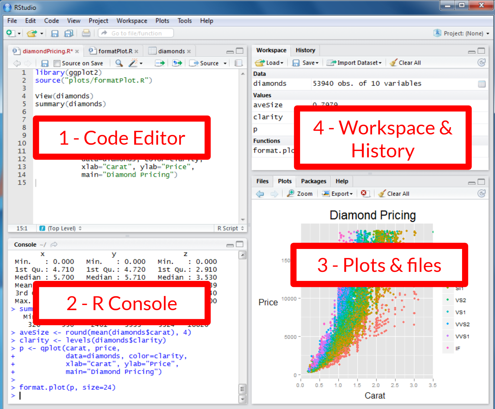
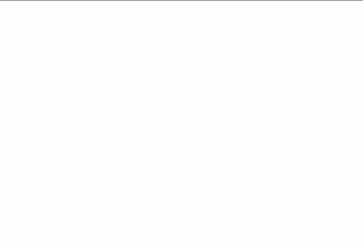

2-Navigating the RStudio Interface
================

- [1 Getting familiar with the RStudio
  Interface](#1-getting-familiar-with-the-rstudio-interface)
  - [1.1 Code Editor:](#11-code-editor)
  - [1.2 Console:](#12-console)
  - [1.3 Files/Plots/Packages/Help
    Pane:](#13-filesplotspackageshelp-pane)
  - [1.4 Environment/History Pane:](#14-environmenthistory-pane)
- [2. Working in the Console](#2-working-in-the-console)
- [3. Working in the Code Editor](#3-working-in-the-code-editor)
  - [3.1 Tips for writing code in an R
    script:](#31-tips-for-writing-code-in-an-r-script)
  - [3.2 Running your code](#32-running-your-code)
  - [3.3 Deleting variables](#33-deleting-variables)


<br>

## 1 Getting familiar with the RStudio Interface


<br> The RStudio interface is divided into several key areas, each
serving a specific purpose.

- You can rearrange these windows and tabs to fit your personal
  preference by dragging them around the
  workspace.<!--chloe make a video on rearranging windows and resetting-->
  When you rearrange the panes in RStudio on your computer, the layout
  stays as you set it across future sessions.

### 1.1 Code Editor:

The code editor is where you write and edit your R scripts. It includes
syntax highlighting, code completion, and other helpful tools to make
coding easier.

The code you write in the editor is just text. RStudio will not execute
the code unless you tell it to. To tell RStudio to execute the code, you 
need to send the code to the console (i.e., "source" the code). We will 
see how to do that in section 3.2.

### 1.2 Console:

The console is where R code is executed.

You can type commands directly into the console, like a scratch pad. It
also displays outputs, messages, and errors.

You might prefer to use the console for immediate execution or testing
of small code snippets or commands. 

When you close RStudio, nothing that was written in the console is saved.
If you want to be able to use your code in the future without needing to
retype it, write it in the code editor, where it will be saved for future 
use (that is, provided you remember to save the file of your script).

### 1.3 Files/Plots/Packages/Help Pane:

**Files:** Browse, open, and manage files in your working directory.

**Plots:** View graphical outputs from your R code, such as plots and
graphs.

**Packages:** Install, update, and load R packages.

**Help:** Access R documentation and help files for:

- Functions and packages
- Example code
- Information about datasets built into R
- Information about other general R-related topics.

**Viewer:** Used to view local web content.

- We won’t be covering this
- E.g., web graphics generated using packages like - googleVis, -
  htmlwidgets - rCharts - local web application created using Shiny,
  Rook, or OpenCPU.
- See more at the RStudio [Viewer
  Page](https://rstudio.github.io/rstudio-extensions/rstudio_viewer.html){:target=“\_blank”}

*Presentation:* You can use RStudio to create presentations (see more
[here](https://fish497.github.io/website/lectures/week_09/lec_27_presentations.html){:target=“\_blank”}).

### 1.4 Environment/History Pane:

**Environment:** Shows your current workspace, including:

- Created objects (i.e. vectors, data frames, etc.)
- Functions you created or loaded

**History:** Records all the commands you’ve run in the current and
previous sessions.

**Connections:** Used to manage and configure the integration of data
sources with your projects.

- E.g., Oracle, SQL, Salesforce

**Tutorial:** Used to run tutorials that will help you learn and master
the R programming language.

- See more at the RStudio [Tutorial
  Page](https://rstudio.github.io/rstudio-extensions/rstudio-tutorials.html){:target=“\_blank”}

<br>

<div class="task-box" markdown="1">

⭐ <u>Task 1-1</u>

**Open RStudio**

Get familiar with the interface by identifying the 4 windows and
switching between the tabs. This task is just for you to get
comfortable. There is no solution for this task.

</div>

## 2. Working in the Console

The console is the action center where your code gets executed
immediately. It’s great for quick experiments or testing ideas, but it
doesn’t save your work!

This is also where you install packages. Packages should be installed
through the console, and loaded through the code editor.

Each new line of code (aka. command line) begins with the angle bracket
`>` also known as the ‘prompt’ symbol. <br>

You will type the commands into the Console after the most recent angle
bracket `>`.

**command line:** lines of code in your console.

**‘prompt’ symbol** `>` : Each new command starts with this.

**execute:** run your command by pressing the ‘enter’ or ‘return’ key on
your keyboard.

- When you are ready to execute (‘run’) the command, type ‘enter’ or
  ‘return’ key on your keyboard.
- The output to the command will appear below your command.

**Things to be mindful of:**

- You cannot execute a command until the previous command has been
  completely executed.

- If you don’t see the prompt symbol, one of two things is happening:

- 1. R is still processing your previous command, and you must wait for it
  to finish.

- 2. You might instead see the plus `+` symbol, which indicates that you
  have entered an incomplete command.

- If you see the `+` symbol, you must enter the remainder of the command
  before entering a new one.

- An error will occur if you write the `+` symbol into your command.

- Sometimes the output can be extensive and show more information than
  you expect (e.g., when you load in a package (we will discuss packages
  more in  Activity 3).
  
<br>

<div class="task-box" markdown="1">

⭐ <u>Task 2-1</u>

**Try getting help!**

To do this, you’ll run the `help()` function. 

For example, `help("mean")` will provide you with information about 
the mean function in RStudio. The help information will be displayed
in the Help pane following your command.

<div id="gif1">

 <br>

</div>

**Task:** Now try getting information on vectors.

{::options parse_block_html='true' /}
<details>
<summary>
Check Your Code
</summary>

``` r
# Get additional information about "vectors" (a data type), 
help("vector") # then type 'enter' or 'return'
```

</details>

{::options parse_block_html='false'/}

</div>

> Note: You can get help on related content by selecting the dropdown
> list at the top of the Help tab. <!--screenshot-->

<br>

## 3. Working in the Code Editor

The code editor is where you write and organize instructions in a script
for R to follow. Think of it as a smart notepad that not only helps you
learn and experiment but also allows you to save your work for later
use. By writing code in the editor, you can easily reuse and adapt your
scripts, and share them with collaborators

<div class="task-box" markdown="1">

⭐ <u>Task 3-1</u>

**Create a new R script.**

1.  Click File \> New File \> R Script.
2.  Save your script: A blank script opens in the code editor. Save it
    by clicking `File` \> `Save` (choose a name and location).

- It is useful to store all related files in one folder, such as this
  script and any data you import/export here.

3.  A blank script opens in the code editor. Start typing your code as
    you would in the console.

</div>

### 3.1 Tips for writing code in an R script:

- To add comments, begin your note with a hash `#`. R will execute each line
  until it encounters a hash, so nothing after a hash will be executed, making
  it great for adding comments. 

  ``` r
  # this is a comment
  ```

  ``` r
  this is not a comment, and will cause an error
  ```

- Use meaningful names (we will learn more about creating variables in
  the following activity page.)

  ``` r
  # BAD naming
  a.dim1 <- 10 # height of object 1
  b.dim2 <- 5 # length of object 2
  ```

  ``` r
  # GOOD naming
  obj1.length <- 10
  obj2.width <- 5
  ```

- Order your code logically.

  - If you want to run your code all at once (perhaps using a different
    data source), it will run each line in order.

### 3.2 Running your code

Run (or source) a single line of code:

1.  Click anywhere on the line you want to run.

2.  Press Ctrl + Enter (Windows/Linux) or Cmd + Enter (Mac).
    Alternatively, you can click the "Run" button at the top
    right corner of the script editor pane.

<br>

Run (or source) multiple lines of code:

1.  Highlight the lines you want to run.

2.  Press Ctrl + Enter (Windows/Linux) or Cmd + Enter (Mac).
    Alternatively, you can click the "Run" button at the top
    right corner of the script editor pane.

- Say you have created two separate variables for different words, as
  well as a third variable that concatenates (combines) those two
  variables. You have also run all of the code line by line as you
  created each variable (Ctrl + Enter (Windows/Linux) or Cmd + Enter
  (Mac)).

  ``` r
  rectangle1.length <- 10 # Line 1
  rectangle1.width <- 5 # Line 2
  # `*` is for multiplication
  rectangle1.area <- rectangle1.length * rectangle1.width # Line 3
  ```

- You then edit `rectangle1.length` to `15` and `rectangle1.width`
  to `8`, but you don’t run each line as you edit it.

  ``` r
  rectangle1.length <- 15 # Line 1
  rectangle1.width <- 8 # Line 2
  rectangle1.area <- rectangle1.length * rectangle1.width # Line 3
  ```

  - If you run only Line 1, the value of `rectangle1.length` will
    change, but `rectangle1.width` and `rectangle1.area` will not
    change. <br>
  - If you run only Line 2, the value of `rectangle1.width` will change,
    but `rectangle1.length` and `rectangle1.area` will not change.<br>
  - If you run only Line 3, no values will change.<br>
  - If you select lines 1, 2, and 3, all values will change.

<br>

Run (or source) the entire script:

1.  Save the script (optional but recommended).

2.  Click Source at the top-right corner of the script editor, or press
    Ctrl + Shift + Enter (Windows/Linux) or Cmd + Shift + Enter (Mac).

<br>

### 3.3 Deleting variables

Deleting the line of code that created a variable will not cause the
variable to be removed.

To delete a variable, delete the line of code in the Code Editor, then
`rm()` function in the console.

``` r
# Line 1 is deleted
rectangle1.width <- 5 # Line 2
#`paste()` concatenates (combines) the values associated with each variable
rectangle1.area <- paste(rectangle1.length, rectangle1.width) # Line 3
```

``` r
> rm(rectangle1.length) # Run in the code editor to remove the variable from your entire environment
```

**WARNING:** If you remove a variable that another variable depends on,
you will see the following error:
`Error: object 'variable name' not found`.

Carefully consider the consequences of removing variables before doing
so.

<br><br>

<div class="task-box" markdown="1">

⭐ <u>Task 3.3-1</u>

**Test editing variables.**

Copy and paste the following code into your new R script (in the code
editor).

1.  Edit the values for `rectangle1.length` and `rectangle1.width`, and
    run each line(s) of code in different orders to see what happens.

2.  Then try deleting different variables through the code editor and
    the console.

``` r
rectangle1.length <- 15 # Line 1
rectangle1.width <- 8 # Line 2
rectangle1.area <- rectangle1.length * rectangle1.width # Line 3
```

</div>

We’ll get to different types of variables in the next activity. Good job!

<br>

------------------------------------------------------------------------

📍 As you work through these activities, remember to save your script(s)
regularly. To do that, click on File > Save (or hit cmd+s on Mac, or 
ctrl+s on Windows)

------------------------------------------------------------------------

<br> <br>

<script>  
function toggle(input) {
    var x = document.getElementById(input);
    if (x.style.display === "none") {
        x.style.display = "block";
    } else {
        x.style.display = "none";
    }
}
</script>
<style>
details {
    background-color: lightgray; 
    padding: 10px;
    margin: 5px;
    border-radius: 5px;
}
.task-box {
      border: 1.5px solid #ccc;
      padding: 10px;
      margin: 10px 0;
      border-radius: 5px;
      background-color: #f5f2f6;
  }
  &#10;</style>
<!--https://gist.github.com/rxaviers/7360908-->

[NEXT STEP: Data Types, Basic Commands and Charting](basics-0.html){:
.btn .btn-blue }
