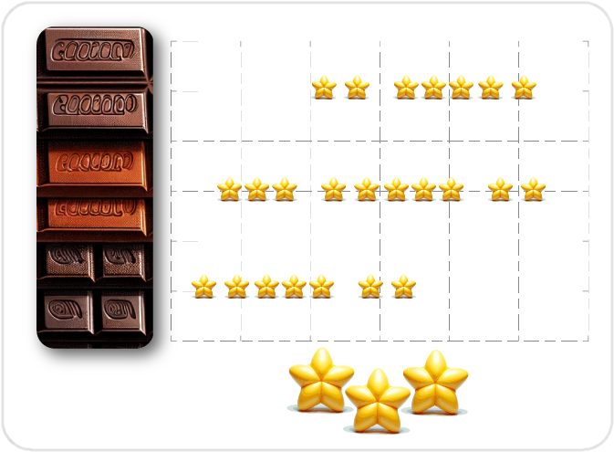
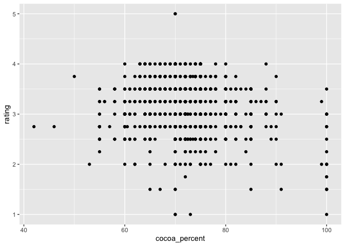

4-Data Visualization with ggplot2
================
<!--Author: DSC / Chloe Farr-->
2024-01-18

- [1. Getting Ready](#1-getting-ready)
- [2. Creating Plots and Charts in
  ggplot2](#2-creating-plots-and-charts-in-ggplot2)
  - [2.1. Scatter Plots](#21-scatter-plots)
  - [2.2. Bar Charts](#22-bar-charts)

If you and your group have any questions or get stuck as you work
through this in-class exercise, please ask the instructor for
assistance. Have fun!

The `ggplot2` package is a popular system for creating data
visualizations like plots, charts, graphs, etc.

In this activity, you will make a scatter plot, bar chart, and a line
chart.

## 1. Getting Ready

<br>

#### <u>Task 1.1:</u> Install and load the ‘ggthemes’ and ‘janitor’ packages.

- Package names:
  - tidyverse
  - ggthemes
  - janitor

<details>
<summary>
Check Your Code
</summary>

``` r
install.packages("ggthemes") #then, as always, type 'enter' or 'return' to submit the command for execution
install.packages("janitor")
library(ggthemes) #Do not wrap library() parameter string in quotes
library(janitor)
```

</details>

<br> *Hint:* wrap the package name in `""` quotations<br> - Do not wrap
the library() parameter in `""` quotations

> More about ggthemes
> [here](https://exts.ggplot2.tidyverse.org/ggthemes.html){:target=“\_blank”}.
> More about janitor
> [here](https://www.rdocumentation.org/packages/janitor/versions/2.2.0){:target=“\_blank”}.

<br>

#### <u>Task 1.2:</u> Read and clean your data set.

- Data set file name: `flavors_of_cacao.csv` (unless you changed the
  filename after downloading)
- Name your variable: `chocolateData`
- Clean the column header names using `clean_names()` where the
  parameter is chocolateData (leave parentheses blank if piping)
- Remove first (empty) row using `filter(ref != "REF")` <br>

<details>
<summary>
Check Your Code
</summary>

``` r
#if your file cannot be found, enter `getwd()` into your console and it will tell you the file path you should most likely use. If you cannot find the file, use Option a.
chocolateData <- read_csv("Desktop/flavors_of_cacao.csv") %>%
  clean_names() %>% #Clean the column header names
  filter(ref != "REF")

#If you get a column specification error, add `, show_col_types = FALSE` as to a parameter read_csv()
#e.g. chocolateData <- read_csv("Desktop/flavors_of_cacao.csv", show_col_types = FALSE)
```

    ## Rows: 1795 Columns: 9
    ## ── Column specification ────────────────────────────────────────────────────────
    ## Delimiter: ","
    ## chr (6): Company 
    ## (Maker-if known), Specific Bean Origin
    ## or Bar Name, Cocoa
    ## ...
    ## dbl (3): REF, Review
    ## Date, Rating
    ## 
    ## ℹ Use `spec()` to retrieve the full column specification for this data.
    ## ℹ Specify the column types or set `show_col_types = FALSE` to quiet this message.

</details>

*Hint:* See Activity 3, Task 3.1 for instructions on importing a csv
file.

<br>

#### <u>Task 1.3:</u> Preview the first 5 rows of your chocolate data.

<details>
<summary>
Check Your Code
</summary>

``` r
#preview first 5 lines of chocolateData
chocolateData %>% head(5)
```

    ## # A tibble: 5 × 9
    ##   company_maker_if_known specific_bean_origin_…¹   ref review_date cocoa_percent
    ##   <chr>                  <chr>                   <dbl>       <dbl> <chr>        
    ## 1 A. Morin               Agua Grande              1876        2016 63%          
    ## 2 A. Morin               Kpime                    1676        2015 70%          
    ## 3 A. Morin               Atsane                   1676        2015 70%          
    ## 4 A. Morin               Akata                    1680        2015 70%          
    ## 5 A. Morin               Quilla                   1704        2015 70%          
    ## # ℹ abbreviated name: ¹​specific_bean_origin_or_bar_name
    ## # ℹ 4 more variables: company_location <chr>, rating <dbl>, bean_type <chr>,
    ## #   broad_bean_origin <chr>

</details>

<br>

## 2. Creating Plots and Charts in ggplot2

Here is some information about creating and formatting plots, common to
all types we will look at in this activity. Don’t do anything yet!

The command to begin plots and charts are very similar. Let’s first look
at the commonalities. For all of them, we will use the `ggplot()`
function and a geometry function. `ggplot()` parameters are:

- The dataset used for the plot `data = datasetName`
- The aesthetic mappings. This specifies which column values is assigned
  to the x axis, and which is assigned to the y axis.
  - `aes(x = columnForXAxis, y = columnForYAxis)`

The geometry function is attached to the ggplot() function with
`+ geom_` and is completed by the type of plot or chart. - scatter plot
or point plots: `+ geom_point()` - bar charts: `geom_bar()` - line
charts: `geom_line()`

Plots will appear in the “Plot” tab (probably in the bottom right hand
quadrant of your workspace).

### 2.1. Scatter Plots

First things first, we need to quickly clean up our dataframe for
scatter plots. Copy and paste the following code into your console, and
execute to imort and prepare our data.

<br>

``` r
#remove the percentage signs from the column cocoa_percent by converting the values to numbers
chocolateData$cocoa_percent <- parse_number(chocolateData$cocoa_percent)

#make sure the data type of each column is correct.
chocolateData <- type_convert(chocolateData)
```

    ## 
    ## ── Column specification ────────────────────────────────────────────────────────
    ## cols(
    ##   company_maker_if_known = col_character(),
    ##   specific_bean_origin_or_bar_name = col_character(),
    ##   company_location = col_character(),
    ##   bean_type = col_character(),
    ##   broad_bean_origin = col_character()
    ## )

``` r
#You can ignore the Column Specification comment in the output. It indicates the column specification, which describes the data types of various columns after conversion, and shows that several columns have been confirmed as character columns.
```

<br>

Let’s apply the ggplot command above to create a scatter plot. <br>

**Definition - Scatter plot:** A plot with two axes, each representing a
different variable. Each individual observation is showing using a
single point. The position of the point is determined by the value of
the variables assigned to the x and y axes for that observation.



#### <u>Task 2.1.1:</u> Make a scatter plot of the cocoa percentage and the rating a chocolate bar received.

- Using chocolate data : `chocolateData`
- X-axis = Cocoa percentage: `cocoa_percent`
- Y-axis = Rating a chocolate bar received: `rating`

<details>
<summary>
Check Your Code
</summary>

``` r
ggplot(data = chocolateData, aes(x = cocoa_percent, y = rating)) +
    geom_point() # then add a layer of points
```

<!-- -->
</details>

<br> Before we add details to our plot, we need to learn about the
different components. Again, wait until the next task to do anything.

**Definition - Fitted line:** (aka. a ‘line of best fit’) is a line
representing some function of x and y that has the best fit (or the
smallest overall error) for the observed data. <br>

Function for adding a smooth line to a plot: `geom_smooth(method = "")`

- method type specifies the type of smoothing to be used

<details>
<summary>
Expand for more geom_smooth method types
</summary>

*Linear Model (“lm”):* fits a linear regression model, suitable for
linear relationships.

*Locally Estimated Scatterplot Smoothing (“loess” or “lowess”)*: creates
a smooth line through the plot by fitting simple models in a localized
manner, which can handle non-linear relationships well. Ideal for
smaller datasets

*Generalized Additive Models (“gam”):* model complex, nonlinear trends
in data.Ideal for larger datasets.

*Moving Average (“ma”):* smooths data by creating an average of
different subsets of the full dataset. It’s useful for highlighting
trends in noisy data.

*Splines (“splines”):* provide a way to smoothly interpolate between
fixed points, creating a piecewise polynomial function. They are useful
for fitting complex, flexible models to data.

*Robust Linear Model (“rlm”):* Similar to linear models but less
sensitive to outliers. It’s useful when your data contains outliers that
might skew the results of a standard linear model.
</details
<br>

- Fitted line: `method = "lm"` <br>

#### <u>Task 2.1.2:</u> Make another scatter plot of the cocoa percentage and the rating a chocolate bar received, with the following:

- A “line of best fit”

- Informative x and y axis labels

- A title

  - Using chocolate data : `chocolateData`
  - X-axis = Cocoa percentage: `cocoa_percent`
  - Y-axis = Rating a chocolate bar received: `rating`
  - Line of best fit: `geom_smooth(method = "lm")`

<details>
<summary>
Check Your Code
</summary>

``` r
ggplot(data = chocolateData, aes(x = cocoa_percent, y = rating)) +
  geom_point() + # then add a layer of points
  geom_smooth(method = "lm")
```

    ## `geom_smooth()` using formula = 'y ~ x'

<!-- -->
</details>

<br>

#### <u>Task 2.1.3:</u> Add descriptive axis labels and a title to your scatter plot.

We’re also going to add labels and custom colors using the `labs()`
function and custom colors.

- Labels `+ labs(title = "", x = "", y = " ")`

<details>
<summary>
Check Your Code
</summary>

``` r
#you can use the following labels or make your own.
ggplot(data = chocolateData, aes(x = cocoa_percent, y = rating)) +
  geom_point() + # then add a layer of points
  geom_smooth(method = "lm") + 
  labs(title = "Rating of Chocolate Bar by Cocoa Percentage", x = "Chocolate Bar Rating", y = "Cocoa Percentage")
```

    ## `geom_smooth()` using formula = 'y ~ x'

<!-- -->
</details>

### 2.2. Bar Charts

First things first, we need to quickly clean up our dataframe for bar
charts. Copy and paste the following code into your console, and
execute. <br>

``` r
chocolateData$bean_type_simplified <- word(chocolateData$bean_type, 1)

chocolateData$bean_type_simplified <- gsub('[[:punct:]]', '', chocolateData$bean_type_simplified)
chocolateData$bean_type_simplified <- trimws(chocolateData$bean_type_simplified)

chocolateData <- chocolateData %>%
filter(str_detect(bean_type_simplified, "\\S")) # This ensures the string contains at least one non-whitespace character

commonBeanTypes <- chocolateData %>%
  select(bean_type_simplified) %>%
  group_by(bean_type_simplified) %>%
  count() %>%
  filter(n > 20) %>%
  ungroup() %>%
  mutate(bean_type_simplified = as.factor(bean_type_simplified))


# Filter chocolateData to only include common beans
chocolateData_commonBeans <- chocolateData %>%
  filter(bean_type_simplified %in% commonBeanTypes$bean_type_simplified)
```

<br>

A bar chart illustrates *categories* along the x axis and the count of
observations from each category on the y axis.

To make a bar chart, you need the data (categories, and values relevate
to those categories), and the categories the data will be separated by
(each representing one bar).

The first 5 rows of the bars made of common beans:

    ## # A tibble: 5 × 10
    ##   company_maker_if_known specific_bean_origin_…¹   ref review_date cocoa_percent
    ##   <chr>                  <chr>                   <dbl>       <dbl>         <dbl>
    ## 1 A. Morin               Carenero                 1315        2014            70
    ## 2 A. Morin               Sur del Lago             1315        2014            70
    ## 3 A. Morin               Puerto Cabello           1319        2014            70
    ## 4 A. Morin               Madagascar               1011        2013            70
    ## 5 A. Morin               Chuao                    1015        2013            70
    ## # ℹ abbreviated name: ¹​specific_bean_origin_or_bar_name
    ## # ℹ 5 more variables: company_location <chr>, rating <dbl>, bean_type <chr>,
    ## #   broad_bean_origin <chr>, bean_type_simplified <chr>

The bars will represent the following categories:

    ## # A tibble: 4 × 2
    ##   bean_type_simplified     n
    ##   <fct>                <int>
    ## 1 Blend                   41
    ## 2 Criollo                213
    ## 3 Forastero              195
    ## 4 Trinitario             436

With the code above, you now have:

- A dataset `chocolateData_commonBeans`: containing the chocolate bars
  made with the most common beans
- A vector `commonBeanTypes` list of the common bean types, which will
  be used as the categories for the x-axis.

#### <u>Task 2.2.1:</u> Create a basic bar chart

Your chart will illustrate the frequency that chocolate bars are being
made in different countries.

- Country bar was made in: `broad_bean_origin`

<details>
<summary>
Check Your Code
</summary>

``` r
ggplot(chocolateData_commonBeans, aes(x = chocolateData_commonBeans$bean_type_simplified)) + geom_bar()
```

<!-- -->
</details>

*Hint:* geom type = “bar”

<br>

**Definition - facets:** A way of breaking apart a plot of a specific
data frame so that each level of a the target factor is shown in a
separate, smaller chart. <br> A faceted bar chart is like a grid of mini
bar charts, each showing a different slice of the data side by side for
comparison.

We can facet a bar chart in a few different ways.

Where the previous bar chart has one piece of information in each bar,
we will now add two. - Instead of `aes(x=)` representing just the
categories that each bar will represent, we will add a `fill=` parameter
for the subgroups of each column. -
`ggplot(data, aes(x = category, fill = subgroup))`

We will then add
`+ geom_bar(position = "fill") + facet_wrap(~facet_variable)`

\-`geom_bar()` creates a stacked bar chart with proportions - ‘fill’
means that each proportion of the bar will total to 100%

``` r
#need to find a column with few enough unique values to show a good visual
```
