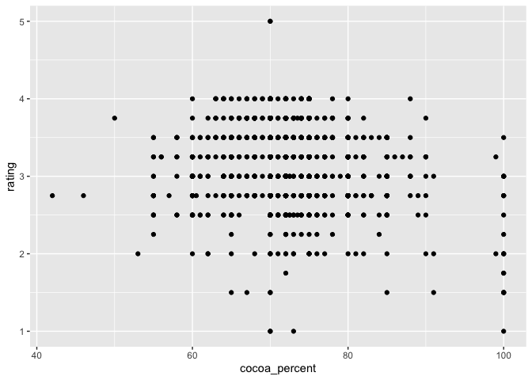
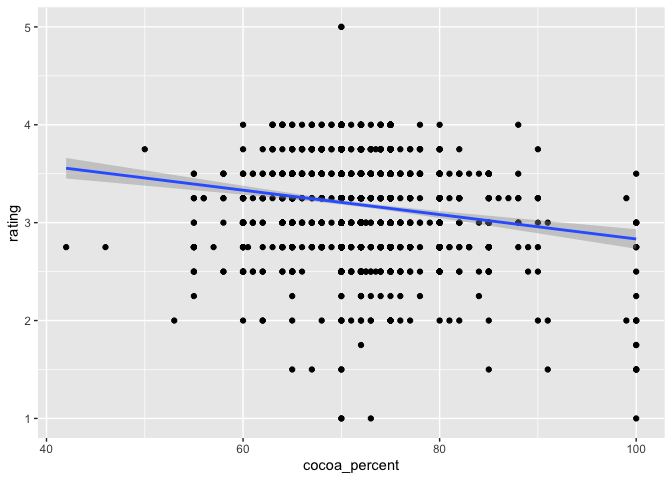
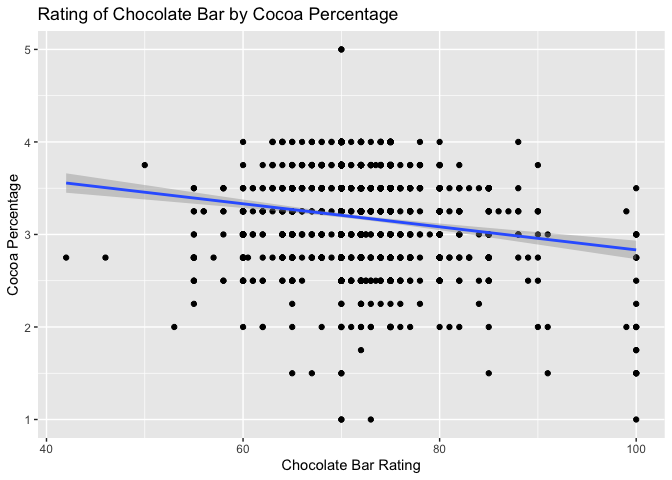
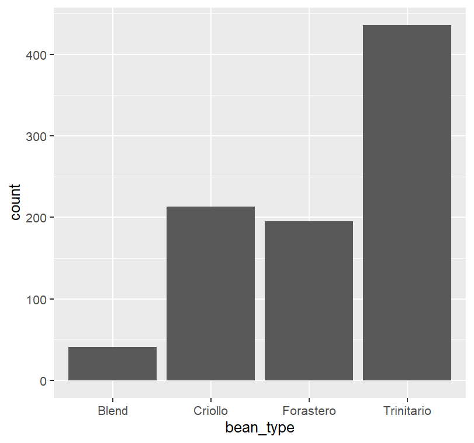

6-Data Visualization with ggplot2
================
DSC Chloe Farr
2024-01-18

- [1. Getting Ready](#1-getting-ready)
- [2. Creating Plots and Charts in
  ggplot2](#2-creating-plots-and-charts-in-ggplot2)
  - [2.1. Scatter Plots](#21-scatter-plots)
  - [2.2. Bar Charts](#22-bar-charts)
  - [2.3. Line Charts](#23-line-charts)

If you and your group have any questions or get stuck as you work
through this in-class exercise, please ask the instructor for
assistance. Have fun!

The `ggplot2` package is a popular system for creating data
visualizations like plots, charts, graphs, etc.

In this activity, you will make a scatter plot, bar chart, and a line
chart.

## 1. Getting Ready

<div class="task-box" markdown="1">

⭐ <u>Task 1-1</u>

**Install and load the ‘ggthemes’ and ‘janitor’ packages.**

- Package names:
  - ggthemes
  - janitor

{::options parse_block_html='true' /}
<details>
<summary>
Check your code
</summary>

``` r
install.packages("ggthemes") #then, as always, type 'enter' or 'return' to submit the command for execution
install.packages("janitor")
library(ggthemes) #Do not wrap library() parameter string in quotes
library(janitor)
```

</details>

{::options parse_block_html='false'/}

<br> *Hint:* wrap the package name in `""` quotations<br> - Do not wrap
the library() parameter in `""` quotations

</div>

Check that you still have Tidyverse loaded. Load tidyverse using `library(tidyverse)` if
needed.

> More about ggthemes
> [here](https://exts.ggplot2.tidyverse.org/ggthemes.html){:target=“\_blank”}.
> More about janitor
> [here](https://www.rdocumentation.org/packages/janitor/versions/2.2.0){:target=“\_blank”}.

<br>

**Download and import data**

From [this
link](https://uviclibraries.github.io/rstudio/docs/flavors_of_cacao.csv){:target=“\_blank”}
download the following data we have prepared for you to use in this
activity.

Save the file in the same folder as your R script.

<div class="task-box" markdown="1">

⭐ <u>Task 1-2</u>

**Read and clean your data set.**

- Data set file name: `flavors_of_cacao.csv` (unless you changed the
  filename after downloading)
- Name your dataframe: `chocolateData`
- Clean the column header names using `clean_names()` where the
  parameter is chocolateData (leave parentheses blank if piping) <br>

{::options parse_block_html='true' /}
<details>
<summary>
Check your code
</summary>

``` r
#in the file path below, replace 'Desktop' with the path to your file.
#if you do not know the path to your file, import it instead by navigate to your file in the Files tab in the bottom right quadrant of your RStudio workspace.
#right click on the filename and select 'import'.
chocolateData <- read_csv("Desktop/flavors_of_cacao.csv") %>%
  clean_names() #Clean the column header names

#If you get a column specification error, add `, show_col_types = FALSE` as to a parameter read_csv()
#e.g. chocolateData <- read_csv("Desktop/flavors_of_cacao.csv", show_col_types = FALSE)
```

    ## Rows: 1795 Columns: 9
    ## ── Column specification ────────────────────────────────────────────────────────
    ## Delimiter: ","
    ## chr (6): Company, SpecificBeanOrigin_BarName, Cocoa_Percent, Company_Location, Bean_Type, Broad Bean_...
    ## dbl (3): REF, Review_Date, Rating
    ## 
    ## ℹ Use `spec()` to retrieve the full column specification for this data.
    ## ℹ Specify the column types or set `show_col_types = FALSE` to quiet this message.

</details>

{::options parse_block_html='false'/}

*Hint:* See Section 4 for instructions on importing a csv file.

</div>

<div class="task-box" markdown="1">

⭐ <u>Task 1-3</u>

**Preview the first 5 rows of your chocolate data.**

{::options parse_block_html='true' /}
<details>
<summary>
Check your code
</summary>

``` r
#preview first 5 lines of chocolateData
chocolateData %>%
    head(5)
```

    ## # A tibble: 5 × 9
    ##   company_maker_if_known specific_bean_origin_…¹   ref review_date cocoa_percent
    ##   <chr>                  <chr>                   <dbl>       <dbl> <chr>        
    ## 1 A. Morin               Agua Grande              1876        2016 63%          
    ## 2 A. Morin               Kpime                    1676        2015 70%          
    ## 3 A. Morin               Atsane                   1676        2015 70%          
    ## 4 A. Morin               Akata                    1680        2015 70%          
    ## 5 A. Morin               Quilla                   1704        2015 70%          
    ## # ℹ abbreviated name: ¹​specific_bean_origin_or_bar_name
    ## # ℹ 4 more variables: company_location <chr>, rating <dbl>, bean_type <chr>,
    ## #   broad_bean_origin <chr>

</details>

{::options parse_block_html='false'/}

</div>

------------------------------------------------------------------------

📍 Reminder! Save your work

------------------------------------------------------------------------

## 2. Creating Plots and Charts in ggplot2

Here is some information about creating and formatting plots, common to
all types we will look at in this activity. Don’t do anything yet!

The command to begin plots and charts are very similar. Let’s first look
at the commonalities. For all of them, we will use the `ggplot()`
function and a geometry function. `ggplot()` parameters are:

- The dataset used for the plot `data = datasetName`
- The aesthetic mappings. This specifies which column values is assigned
  to the x axis, and which is assigned to the y axis.
  - `aes(x = columnForXAxis, y = columnForYAxis)`

The geometry function is attached to the ggplot() function with
`+ geom_` and is completed by the type of plot or chart:
- scatter plot or point plots: `+ geom_point()`
- bar charts: `geom_bar()`
- line charts: `geom_line()`

Plots will appear in the “Plot” tab (probably in the bottom right hand
quadrant of your workspace).

### 2.1. Scatter Plots

First things first, we need to quickly clean up our data frame for
scatter plots.

**Copy and paste the following code into your console and execute it.**

<br>

``` r
#remove the percentage signs from the column cocoa_percent by converting the values to numbers
chocolateData$cocoa_percent <- parse_number(chocolateData$cocoa_percent)

#make sure the data type of each column is correct.
chocolateData <- type_convert(chocolateData)
```

    ## 
    ## ── Column specification ────────────────────────────────────────────────────────
    ## cols(
    ##   company_maker_if_known = col_character(),
    ##   specific_bean_origin_or_bar_name = col_character(),
    ##   company_location = col_character(),
    ##   bean_type = col_character(),
    ##   broad_bean_origin = col_character()
    ## )

``` r
#You can ignore the Column Specification comment in the output. It indicates the column specification, which describes the data types of various columns after conversion, and shows that several columns have been confirmed as character columns.
```

<br>

Let’s apply the ggplot command above to create a scatter plot. <br>

**Definition - Scatter plot:** A plot with two axes, each representing a
different variable. Each individual observation is showing using a
single point. The position of the point is determined by the value of
the variables assigned to the x and y axes for that observation.


------------------------------------------------------------------------

📍 Reminder! Save your work

------------------------------------------------------------------------

<div class="task-box" markdown="1">

⭐ <u>Task 2.1-1</u>

**Make a scatter plot of the cocoa percentage and the rating a chocolate
bar received.**

- Using chocolate data : `chocolateData`
- X-axis = Cocoa percentage: `cocoa_percent`
- Y-axis = Rating a chocolate bar received: `rating`

{::options parse_block_html='true' /}
<details>
<summary>
Check your code
</summary>

``` r
ggplot(data = chocolateData, aes(x = cocoa_percent, y = rating)) +
    geom_point() # then add a layer of points
```


</details>

{::options parse_block_html='false'/}

</div>

<br> Before we add details to our plot, we need to learn about the
different components. Again, wait until the next task to do anything.

**Definition - Fitted line:** (aka. a ‘line of best fit’) is a line
representing some function of x and y that has the best fit (or the
smallest overall error) for the observed data. <br>

Function for adding a smooth line to a plot: `geom_smooth(method = "")`

- method type specifies the type of smoothing to be used

<details markdown ="1">
<summary>
Expand for more geom_smooth method types
</summary>

- *Linear Model (“lm”):* fits a linear regression model, suitable
for linear relationships.
- *Locally Estimated Scatterplot Smoothing (“loess” or “lowess”)*: creates
a smooth line through the plot by fitting simple models in a localized
manner, which can handle non-linear relationships well. Ideal for
smaller datasets
- *Generalized Additive Models (“gam”):* model complex, nonlinear trends
in data.Ideal for larger datasets.
- *Moving Average (“ma”):* smooths data by creating an average of
different subsets of the full dataset. It’s useful for highlighting
trends in noisy data.
- *Splines (“splines”):* provide a way to smoothly interpolate between
fixed points, creating a piecewise polynomial function. They are useful
for fitting complex, flexible models to data.
- *Robust Linear Model (“rlm”):* Similar to linear models but less
sensitive to outliers. It’s useful when your data contains outliers that
might skew the results of a standard linear model.

</details>

<br>

- Fitted line: `method = "lm"`

<div class="task-box" markdown="1">

⭐ <u>Task 2.1-2</u>

**Make another scatter plot of the cocoa percentage and the rating a
chocolate bar received**, with the following:

- A “line of best fit”

Remember:
- Using chocolate data: `chocolateData`
- X-axis = Cocoa percentage: `cocoa_percent`
- Y-axis = Rating a chocolate bar received: `rating`
- Line of best fit: `geom_smooth(method = "lm")`

{::options parse_block_html='true' /}
<details>
<summary>
Check your code
</summary>

``` r
ggplot(data = chocolateData, aes(x = cocoa_percent, y = rating)) +
  geom_point() + # then add a layer of points
  geom_smooth(method = "lm")
```

    ## `geom_smooth()` using formula = 'y ~ x'


</details>

{::options parse_block_html='false'/}

</div>

<div class="task-box" markdown="1">

⭐ <u>Task 2.1-3</u>

**Add descriptive axis labels and a title to your scatter plot.**

We’re also going to add labels and custom colors using the `labs()`
function and custom colors.

- Labels `+ labs(title = "", x = "", y = " ")`

{::options parse_block_html='true' /}
<details>
<summary>
Check your code
</summary>

``` r
# you can use the following labels or make your own.
ggplot(data = chocolateData, aes(x = cocoa_percent, y = rating)) +
  geom_point() + # then add a layer of points
  geom_smooth(method = "lm") + 
  labs(title = "Rating of Chocolate Bar by Cocoa Percentage", x = "Chocolate Bar Rating", y = "Cocoa Percentage")
```

    ## `geom_smooth()` using formula = 'y ~ x'


</details>

{::options parse_block_html='false'/}

</div>

### 2.2. Bar Charts

First things first, we need to quickly clean up our dataframe for bar
charts. Copy and paste the following code into your console, and
execute. <br>

``` r
chocolateData <- chocolateData %>%
# A few steps to clean the bean type variable
  mutate(
    bean_type_simplified = word(bean_type, 1), # get just the first word
    bean_type_simplified = gsub('[[:punct:]]', '', bean_type_simplified), # reove punctuations
    bean_type_simplified = trimws(bean_type_simplified) # remove white spaces
  ) %>%
  filter(str_detect(bean_type_simplified, "\\S")) # This ensures the string contains at least one non-whitespace character

# Get the most common bean types
commonBeanTypes <- chocolateData %>%
  select(bean_type_simplified) %>%
  group_by(bean_type_simplified) %>%
  count() %>%
  filter(n > 20) %>%
  ungroup() %>%
  mutate(bean_type_simplified = as.factor(bean_type_simplified))


# Filter chocolateData to only include common beans
chocolateData_commonBeans <- chocolateData %>%
  filter(bean_type_simplified %in% commonBeanTypes$bean_type_simplified)
```

<br>

A bar chart illustrates *categories* along the x-axis and the count of
observations from each category on the y-axis.

To make a bar chart, you need the data (categories, and values relevant
to those categories), and the categories the data will be separated by
(each representing one bar).

The first 5 rows of the dataframe filtered for the common bean types:

    ## # A tibble: 5 × 10
    ##   company_maker_if_known specific_bean_origin_…¹   ref review_date cocoa_percent
    ##   <chr>                  <chr>                   <dbl>       <dbl>         <dbl>
    ## 1 A. Morin               Carenero                 1315        2014            70
    ## 2 A. Morin               Sur del Lago             1315        2014            70
    ## 3 A. Morin               Puerto Cabello           1319        2014            70
    ## 4 A. Morin               Madagascar               1011        2013            70
    ## 5 A. Morin               Chuao                    1015        2013            70
    ## # ℹ abbreviated name: ¹​specific_bean_origin_or_bar_name
    ## # ℹ 5 more variables: company_location <chr>, rating <dbl>, bean_type <chr>,
    ## #   broad_bean_origin <chr>, bean_type_simplified <chr>

The bars will represent the following categories:

    ## # A tibble: 4 × 2
    ##   bean_type_simplified     n
    ##   <fct>                <int>
    ## 1 Blend                   41
    ## 2 Criollo                213
    ## 3 Forastero              195
    ## 4 Trinitario             436

With the code above, you now have:

- A dataset `chocolateData_commonBeans`: containing the chocolate bars
  made with the most common beans
- A variable `bean_type_simplified`, which lists the types of beans to
  be used as the categories for the x-axis.

The call for bar charts in ggplot2 `geom_bar` makes the height of the bar 
proportional to the number of observations in each group of a categorical
variable, so you only need to tell ggplot2 the variable you want to use for
the bar chart, and it makes the calculations in the background.

<div class="task-box" markdown="1">

⭐ <u>Task 2.2-1</u>

**Create a basic bar chart.**

Your chart will illustrate the numbers of bars of different types of the most
common bean types that are being made.

{::options parse_block_html='true' /}
<details>
<summary>
Check Your Code and Output
</summary>

``` r
ggplot(chocolateData_commonBeans, aes(x = bean_type_simplified))+
  geom_bar()
```

Output:


</details>

{::options parse_block_html='false'/}

*Hint:* geom type = “bar”

</div>

A stacked bar chart shows two dimensions (variables) of data. Each bar
will represent one variable, and each bar will be chopped into sections
which represent a second variable.

<div class="task-box" markdown="1">

⭐ <u>Task 2.2-2</u>

**Create a stacked bar chart.**

To add a second dimension,

- following the same command as the bar chart above, modify it by:
  - adding the parameter `fill=~factor2name` to `aes()`, where
    ‘factor2name’ is the second variable’s column name.
  - setting the parameter of `geom_bar()` to `position="stack"`

{::options parse_block_html='true' /}
<details>
<summary>
Check Your Code and Output
</summary>

``` r
ggplot(chocolateData_commonBeans, aes(x = bean_type_simplified, fill = company_location)) +
  geom_bar(position = "stack")
```

Output:

<!-- -->
</details>

{::options parse_block_html='false'/}

</div>

<br> **Definition - facets:** A way of breaking apart a plot of a
specific data frame so that each level of a the target factor is shown
in a separate, smaller chart. <br> A faceted bar chart is like a grid of
mini bar charts, each showing a different slice of the data side by side
for comparison.

We can facet a bar chart in a few different ways.

- Where the previous bar chart has one piece of information in each bar,
  we will now add two.

  - Instead of `aes(x=)` representing just the categories that each bar
    will represent, we will add a `fill=` parameter for the subgroups of
    each column.
  - `ggplot(data, aes(x = category, fill = subgroup))`

- We will then add
  `+ geom_bar(position = "fill") + facet_wrap(~facet_variable)`

- `geom_bar()` creates a stacked bar chart with proportions

  - ‘fill’ means that each proportion of the bar will total to 100%

``` r
ggplot(chocolateData_commonBeans, aes(x = chocolateData_commonBeans$bean_type_simplified)) + geom_bar(position = "fill") + facet_wrap(~facet_variable)
```

### 2.3. Line Charts

<div class="task-box" markdown="1">

⭐ <u>Task 2.3-1</u>

**Create a variable with the mean chocolate rating by year.**

Using piping, create a new variable, `meanRatingByYear`

- base data: `chocolateData`
- group_by: `review_date`
- use `summarise()`
  - the parameter is `rating=mean(rating)`

{::options parse_block_html='true' /}
<details>
<summary>
Check Your Code
</summary>

``` r
meanRatingByYear <- chocolateData %>% group_by(review_date)%>%summarise(rating=mean(rating))
```

Your output will be:

</details>

{::options parse_block_html='false'/}

Then convert “review_date” to Date class by entering

``` r
meanRatingByYear$review_date <- as.integer(meanRatingByYear$review_date)
```

</div>

<div class="task-box" markdown="1">

⭐ <u>Task 2.3-2</u>

**Create a line chart using the mean chocolate rating by year.**

Here we’ll make a line chart to show how the mean rating of chocolate
has changed by year.

- Your base data will be the mean rating table you just created
- the x axis value will be the review date
- the y axis will be the rating
- the geom type is `line`, with no parameter

After the geom type, add:

`ggplot(meanRatingByYear, aes(x = review_date, y = rating)) + geom_line()+  scale_x_continuous(breaks = meanRatingByYear$review_date,  labels = as.character(meanRatingByYear$review_date))`

{::options parse_block_html='true' /}
<details>
<summary>
Check Your Code
</summary>

``` r
ggplot(meanRatingByYear, aes(x = review_date, y = rating)) +
  geom_line()+  scale_x_continuous(
    breaks = meanRatingByYear$review_date,  # Use actual review dates for breaks
    labels = as.character(meanRatingByYear$review_date)  # Convert to character to avoid decimals
  )
```

Output:

<!-- -->
</details>

{::options parse_block_html='false'/}

</div>

<div class="task-box" markdown="1">

⭐ <u>Task 2.3-3</u>

**Style your line chart.**

Using the same chart you just made, add some stylistic features and
modifications.

- rename the x label to “Review Date”
- rename the y label to “Rating”
- Add a title using `ggtitle()` : “Change in Rating Over Time

{::options parse_block_html='true' /}
<details>
<summary>
Check Your Code
</summary>

``` r
ggplot(meanRatingByYear, aes(x = review_date, y = rating)) +
  geom_line() +
  scale_x_continuous(
    breaks = meanRatingByYear$review_date,  # Use actual review dates for breaks
    labels = as.character(meanRatingByYear$review_date)  # Convert to character to avoid decimals
  ) +
  labs(
    x = "Review Date", 
    y = "Rating", 
    title = "Change in Rating Over Time"
  ) 
```

<br> Output:

<!-- -->
</details>

{::options parse_block_html='false'/}

</div>

------------------------------------------------------------------------

📍 Reminder! Save your work

------------------------------------------------------------------------

<script>  
function toggle(input) {
    var x = document.getElementById(input);
    if (x.style.display === "none") {
        x.style.display = "block";
    } else {
        x.style.display = "none";
    }
}
</script>
<style>
details {
    background-color: lightgray; 
    padding: 10px;
    margin: 5px;
    border-radius: 5px;
}
.task-box {
      border: 1.5px solid #ccc;
      padding: 10px;
      margin: 10px 0;
      border-radius: 5px;
      background-color: #f5f2f6;
  }
  &#10;</style>
<!--https://gist.github.com/rxaviers/7360908-->

[Earn a workshop badge](informal-credentials.html){: .btn .btn-blue }
