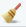
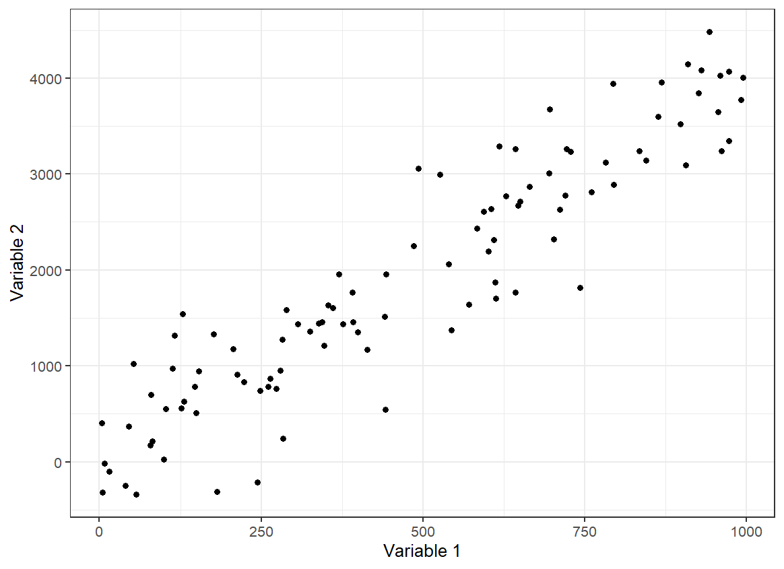
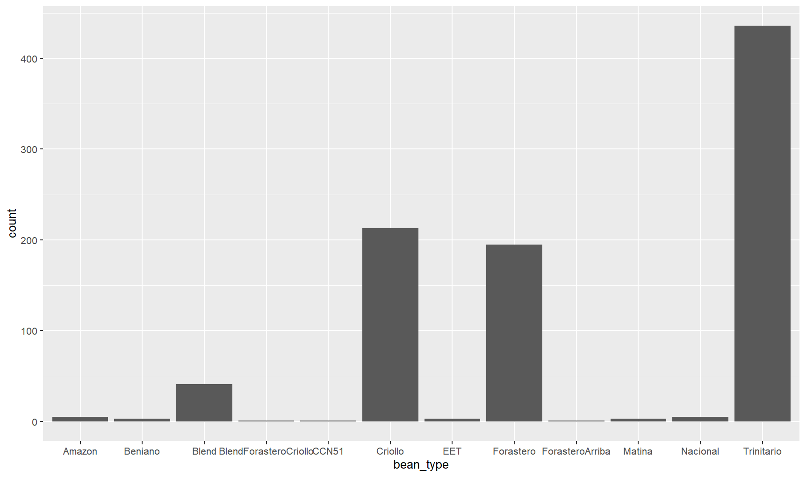
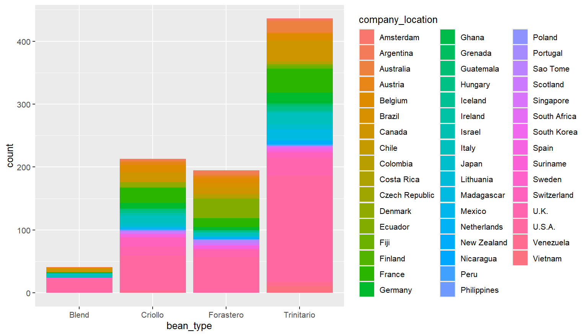
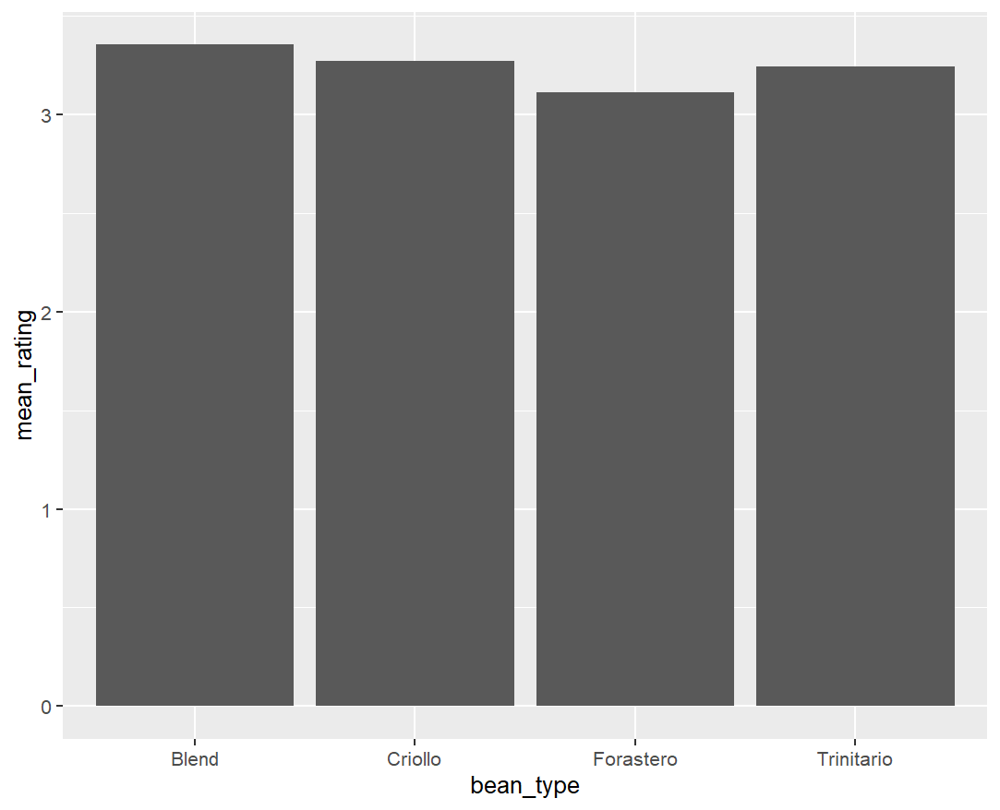
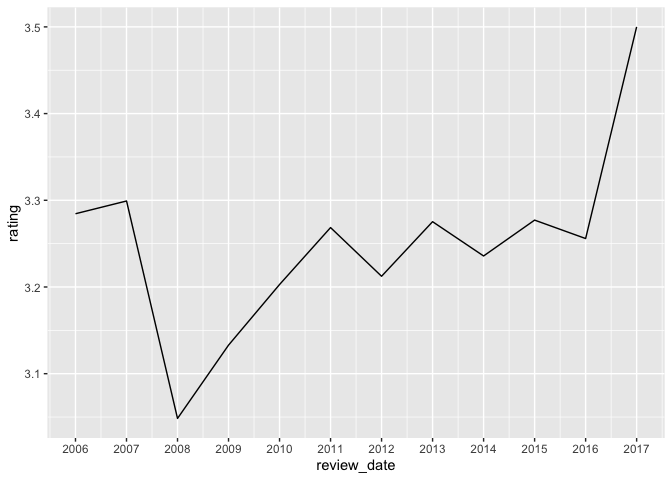
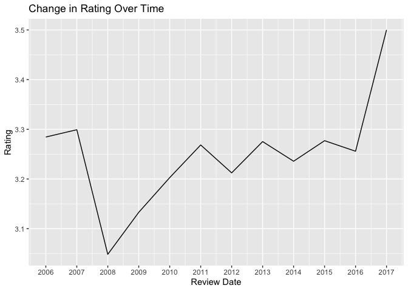

6-Data Visualization with ggplot2
================

- [1. Getting Ready](#1-getting-ready)
  - [1.1 Prepare your working environment](#11-prepare-your-working-environment)
  - [1.2 Load your data](#12-load-your-data)
  - [1.3 1.3 Check your data](#13-check-your-data)
  - [1.4 Clean your data](#14-clean-your-data)
- [2. Creating Plots and Charts in
  ggplot2](#2-creating-plots-and-charts-in-ggplot2)
  - [2.1. Scatter Plots](#21-scatter-plots)
  - [2.2. Bar Charts](#22-bar-charts)
  - [2.3. Line Charts](#23-line-charts)

If you and your group have any questions or get stuck as you work
through this in-class exercise, please ask the instructor for
assistance. Have fun!

The `ggplot2` package is a popular system for creating data
visualizations like plots, charts, graphs, etc.

In this activity, you will make a scatter plot, bar chart, and a line
chart.

Before you start this activity, let's give your RStudio session a fresh start. For that:
- Save your previous scripts by clicking on File > Save, or on the save icon on the top left. If needed, choose a folder to save it (probably the working directory you were working on in the previous activity) and give it a meaningful name.
- Close the script by clicking on File > Close or on the x next to the file name on the top left.
- Clean your R environment (i.e., remove all the objects) by clicking on the broom icon  on the top right and clicking yes on the pop-up window that appears.
-  Create a new script by clicking on File > New File > R Script, or on the New Script icon  on the top left.

## 1. Getting Ready

### 1.1 Prepare your working environment

You will use both the `tidyverse` and the `janitor` package in this activity. You should already have the `tidyverse` package installed on your computer for previous activities, but not the `janitor` package. So before you continue, make sure to install the `janitor` package by running the following code in your console:

``` r
install.packages("janitor")
``` 

<div class="task-box" markdown="1">

⭐ <u>Task 6-1</u>

**Prepare your working environment.**

Prepare your working environment by loading the `tidyverse` and `janitor` packages (the `ggplot2` package is part of the tidyverse package) and setting your working directory.

{::options parse_block_html='true' /}
<details>
<summary>
Check your code
</summary>

``` r
# load packages
library(tidyverse)
library(janitor)

# set working directory
setwd("path-to-folder") # Remeber to substitute "path-to-folder" by the actual path to your folder
```
</details>

{::options parse_block_html='false'/}

</div>

### 1.2 Load your data

From [this
link](https://uviclibraries.github.io/rstudio/docs/flavors_of_cacao.csv){:target=“\_blank”}
download the following data we have prepared for you to use in this
activity. Save the file in your working directory.

<div class="task-box" markdown="1">

⭐ <u>Task 6-2</u>

**Read your data set.**

- Data set file name: `flavors_of_cacao.csv`
- Name your dataframe: `chocolateData`

{::options parse_block_html='true' /}
<details>
<summary>
Check your code
</summary>

``` r
# read data
chocolateData <- read.csv("flavors_of_cacao.csv")
```
</details>

{::options parse_block_html='false'/}

*Hint:* See Section 4 for instructions on importing a .csv file.

</div>

### 1.3 Check your data

<div class="task-box" markdown="1">

⭐ <u>Task 6-3</u>

**Preview the first 5 rows of your chocolate data.**

{::options parse_block_html='true' /}
<details>
<summary>
Check your code
</summary>

``` r
# Check data
chocolateData %>% head(5) # Preview first 5 lines of chocolateData
```

    ##    Company SpecificBeanOrigin_BarName  REF Review_Date Cocoa_Percent Company_Location Rating
    ## 1 A. Morin                Agua Grande 1876        2016           63%           France   3.75
    ## 2 A. Morin                      Kpime 1676        2015           70%           France   2.75
    ## 3 A. Morin                     Atsane 1676        2015           70%           France   3.00
    ## 4 A. Morin                      Akata 1680        2015           70%           France   3.50
    ## 5 A. Morin                     Quilla 1704        2015           70%           France   3.50
    ##   Bean_Type Broad.Bean_Origin
    ## 1                    Sao Tome
    ## 2                        Togo
    ## 3                        Togo
    ## 4                        Togo
    ## 5                        Peru

</details>

{::options parse_block_html='false'/}

</div>

Another way to inspect your data is to use the `str()` function presented in section 4.

<div class="task-box" markdown="1">

⭐ <u>Task 6-4</u>

**See the structure of your data.**

{::options parse_block_html='true' /}
<details>
<summary>
Check your code
</summary>

``` r
# Check data
str(chocolateData)
```
    ## 'data.frame':	1795 obs. of  9 variables:
    ##  $ Company                   : chr  "A. Morin" "A. Morin" "A. Morin" "A. Morin" ...
    ##  $ SpecificBeanOrigin_BarName: chr  "Agua Grande" "Kpime" "Atsane" "Akata" ...
    ##  $ REF                       : int  1876 1676 1676 1680 1704 1315 1315 1315 1319 1319 ...
    ##  $ Review_Date               : int  2016 2015 2015 2015 2015 2014 2014 2014 2014 2014 ...
    ##  $ Cocoa_Percent             : chr  "63%" "70%" "70%" "70%" ...
    ##  $ Company_Location          : chr  "France" "France" "France" "France" ...
    ##  $ Rating                    : num  3.75 2.75 3 3.5 3.5 2.75 3.5 3.5 3.75 4 ...
    ##  $ Bean_Type                 : chr  " " " " " " " " ...
    ##  $ Broad.Bean_Origin         : chr  "Sao Tome" "Togo" "Togo" "Togo" ...

</details>

{::options parse_block_html='false'/}

</div>

We can see that the dataset is composed of 1795 observations of chocolates, where 9 variables have been measured. The result also shows you the names of the variables and the type of each variable. With this type of result, you can identify certain elements of your dataset that you might want to clean before starting with data visualization and analysis.

In the above example, you can see that variable names do not have a standardized format such as all lower caps, or using only "." or "_" instead of spaces. Moreover, you can see that the percent of cocoa in each chocolate was read as a character because it contains the % sign, but you might want to make this into numeric values for data analysis. Next, we will see simple ways to clean your data.

### 1.4 Clean your data

After checking your dataset, you might encounter some errors that you want to correct in your data. Cleaning your data and making sure that it is in good shape for data visualization and analysis is an important step. Here we will go through some basic data cleaning steps.

<div class="task-box" markdown="1">

⭐ <u>Task 6-4</u>

**Standardize column names**

Use the `clean_names()` function from the `janitor` package to automatically standardize column names formatting. The `clean_names()` function requires only one parameter: the dataframe name.

*Hint:* Remember to overwrite `chocolateData` with the object with the new column names, otherwise R will not save the new column names.

{::options parse_block_html='true' /}
<details>
<summary>
Check your code
</summary>

``` r
## standardize column names
chocolateData <- clean_names(chocolateData)
## view column names after standardization
str(chocolateData)
```
    ## 'data.frame':	1795 obs. of  9 variables:
    ##  $ company                      : chr  "A. Morin" "A. Morin" "A. Morin" "A. Morin" ...
    ##  $ specific_bean_origin_bar_name: chr  "Agua Grande" "Kpime" "Atsane" "Akata" ...
    ##  $ ref                          : int  1876 1676 1676 1680 1704 1315 1315 1315 1319 1319 ...
    ##  $ review_date                  : int  2016 2015 2015 2015 2015 2014 2014 2014 2014 2014 ...
    ##  $ cocoa_percent                : chr  "63%" "70%" "70%" "70%" ...
    ##  $ company_location             : chr  "France" "France" "France" "France" ...
    ##  $ rating                       : num  3.75 2.75 3 3.5 3.5 2.75 3.5 3.5 3.75 4 ...
    ##  $ bean_type                    : chr  " " " " " " " " ...
    ##  $ broad_bean_origin            : chr  "Sao Tome" "Togo" "Togo" "Togo" ...

</details>

{::options parse_block_html='false'/}

</div>

<div class="task-box" markdown="1">

⭐ <u>Task 6-6</u>

**Fix percent values**

Remove the percentage signs from the column cocoa_percent by converting the values to numbers using the functions `mutate()` and `parse_number()`. The `parse_number()` function takes in as a parameter a vector and drops all the non-numeric characters, transforming it into a numeric vector.

*Hint:* Remember to overwrite `chocolateData` with the object with the new column names, otherwise R will not save the new column names.

{::options parse_block_html='true' /}
<details>
<summary>
Check your code
</summary>

``` r
# cleans % from cocoa_percent
chocolateData <- chocolateData %>% # get the dataframe
  mutate( # identified that you want to "mutate" a variable
    cocoa_percent = parse_number(cocoa_percent) # overwrite cocoa_percent variable after having used the parsed_number function
  )
## view data frame after cleaning. Note how the cocoa_percent variable is now nueric
str(chocolateData)
```
    ## 'data.frame':	1795 obs. of  9 variables:
    ##  $ company                      : chr  "A. Morin" "A. Morin" "A. Morin" "A. Morin" ...
    ##  $ specific_bean_origin_bar_name: chr  "Agua Grande" "Kpime" "Atsane" "Akata" ...
    ##  $ ref                          : int  1876 1676 1676 1680 1704 1315 1315 1315 1319 1319 ...
    ##  $ review_date                  : int  2016 2015 2015 2015 2015 2014 2014 2014 2014 2014 ...
    ##  $ cocoa_percent                : num  63 70 70 70 70 70 70 70 70 70 ...
    ##  $ company_location             : chr  "France" "France" "France" "France" ...
    ##  $ rating                       : num  3.75 2.75 3 3.5 3.5 2.75 3.5 3.5 3.75 4 ...
    ##  $ bean_type                    : chr  " " " " " " " " ...
    ##  $ broad_bean_origin            : chr  "Sao Tome" "Togo" "Togo" "Togo" ...

</details>

{::options parse_block_html='false'/}

</div>

------------------------------------------------------------------------

📍 Reminder! Save your work

------------------------------------------------------------------------

## 2. Creating plots and charts in ggplot2

Here is some information about creating and formatting plots, common to
all types we will look at in this activity. Don’t do anything yet!

The command to begin plots and charts are very similar. Let’s first look
at the commonalities. For all of them, we will use the `ggplot()`
function and a geometry function. `ggplot()` parameters are:

- The dataset used for the plot `data = datasetName`
- The aesthetic mappings. This specifies which column values is assigned
  to the x axis, and which is assigned to the y axis.
  - `aes(x = columnForXAxis, y = columnForYAxis)`

The geometry function is attached to the ggplot() function with
`+ geom_` and is completed by the type of plot or chart:
- scatter plot or point plots: `+ geom_point()`
- bar charts: `geom_bar()`
- line charts: `geom_line()`

Plots will appear in the “Plot” tab (probably in the bottom right hand
quadrant of your workspace).

### 2.1. Scatter Plots

Let’s apply the ggplot command above to create a scatter plot. <br>

**Definition - Scatter plot:** A plot with two axes, each representing a
different variable. Each individual observation is shown using a
single point. The position of the point is determined by the value of
the variables assigned to the x and y axes for that observation.



------------------------------------------------------------------------

📍 Reminder! Save your work

------------------------------------------------------------------------

<div class="task-box" markdown="1">

⭐ <u>Task 2.1-1</u>

**Make a scatter plot of the cocoa percentage and the rating a chocolate
bar received.**

- Using chocolate data : `chocolateData`
- X-axis = Cocoa percentage: `cocoa_percent`
- Y-axis = Rating a chocolate bar received: `rating`

{::options parse_block_html='true' /}
<details>
<summary>
Check your code
</summary>

``` r
ggplot(data = chocolateData, aes(x = cocoa_percent, y = rating)) +
    geom_point() # then add a layer of points
```


</details>

{::options parse_block_html='false'/}

</div>

<br> Before we add details to our plot, we need to learn about the
different components. Again, wait until the next task to do anything.

**Definition - Fitted line:** (aka. a ‘line of best fit’) is a line
representing some function of x and y that has the best fit (or the
smallest overall error) for the observed data. <br>

Function for adding a smooth line to a plot: `geom_smooth(method = "")`

- method type specifies the type of smoothing to be used

<details markdown ="1">
<summary>
Expand for more geom_smooth method types
</summary>

- *Linear Model (“lm”):* fits a linear regression model, suitable
for linear relationships.
- *Locally Estimated Scatterplot Smoothing (“loess” or “lowess”)*: creates
a smooth line through the plot by fitting simple models in a localized
manner, which can handle non-linear relationships well. Ideal for
smaller datasets
- *Generalized Additive Models (“gam”):* model complex, nonlinear trends
in data. Ideal for larger datasets.
- *Moving Average (“ma”):* smooths data by creating an average of
different subsets of the full dataset. It’s useful for highlighting
trends in noisy data.
- *Splines (“splines”):* provide a way to smoothly interpolate between
fixed points, creating a piecewise polynomial function. They are useful
for fitting complex, flexible models to data.
- *Robust Linear Model (“rlm”):* Similar to linear models but less
sensitive to outliers. It’s useful when your data contains outliers that
might skew the results of a standard linear model.

</details>

<br>

- Fitted line: `method = "lm"`

<div class="task-box" markdown="1">

⭐ <u>Task 2.1-2</u>

**Make another scatter plot of the cocoa percentage and the rating a
chocolate bar received**, with the following:

- A “line of best fit”

Remember:
- Using chocolate data: `chocolateData`
- X-axis = Cocoa percentage: `cocoa_percent`
- Y-axis = Rating a chocolate bar received: `rating`
- Line of best fit: `geom_smooth(method = "lm")`

{::options parse_block_html='true' /}
<details>
<summary>
Check your code
</summary>

``` r
ggplot(data = chocolateData, aes(x = cocoa_percent, y = rating)) +
  geom_point() + # then add a layer of points
  geom_smooth(method = "lm")
```

    ## `geom_smooth()` using formula = 'y ~ x'


</details>

{::options parse_block_html='false'/}

</div>

<div class="task-box" markdown="1">

⭐ <u>Task 2.1-3</u>

**Add descriptive axis labels and a title to your scatter plot.**

We’re also going to add labels and custom colors using the `labs()`
function and custom colors.

- Labels `+ labs(title = "", x = "", y = " ")`

{::options parse_block_html='true' /}
<details>
<summary>
Check your code
</summary>

``` r
# you can use the following labels or make your own.
ggplot(data = chocolateData, aes(x = cocoa_percent, y = rating)) +
  geom_point() + # then add a layer of points
  geom_smooth(method = "lm") + 
  labs(title = "Rating of Chocolate Bar by Cocoa Percentage", x = "Chocolate Bar Rating", y = "Cocoa Percentage")
```

    ## `geom_smooth()` using formula = 'y ~ x'


</details>

{::options parse_block_html='false'/}

</div>

### 2.2. Bar Charts

A bar chart shows the relationship between a categorical variable (on the *x-axis*) and a numerical variable (on the *y-axis*). 

A common type of bar plot is one that illustrates *categories* along the x-axis and the count of observations from each category on the y-axis.

For this type of data, the call for bar charts in ggplot2 `geom_bar` makes the height of the bar proportional to the number of observations in each group of a categorical variable, so you only need to tell ggplot2 the variable you want to use on the *x-axis* of your bar chart, and it makes the calculations for the *y-axis* in the background.

For example, let's make a bar chart that shows the number of chocolate bars that are made for different types of cacao beans.

<div class="task-box" markdown="1">

⭐ <u>Task 2.2-1</u>

**Create a basic bar chart.**

Your chart will illustrate the number of bars of different types of beans that are being made.

- Use the `chocolateData` object inside the ggplot call
- Specify the variable `bean_type` for the x-axis
- Use `+ geom_bar()` to plot a bar chart

{::options parse_block_html='true' /}
<details>
<summary>
Check Your Code and Output
</summary>

``` r
ggplot(chocolateData, aes(x = bean_type))+
  geom_bar()
```

Output:


</details>

{::options parse_block_html='false'/}

*Hint:* you do not need to specify anything for the y-axis in this case

</div>

You can see that the plot is hard to interpret, as there are many bean types that are not commonly made. In this case, it would be best to plot only the most common bean types. For that, we first need to create a new dataset that contains only the most common bean types.

To do that, we need to calculate the number of bars of each type that are being made. We can use the `group_by()` function that you learned in the previous section:
```r
# Get the most common bean types
bars_per_type <- chocolateData %>% # get the dataframe
  group_by(bean_type) %>% # group by bean type
  count() # count the number of bars per bean_type

# check the new data frame
bars_per_type
```
    ## # A tibble: 12 × 2
    ## # Groups:   bean_type [12]
    ##    bean_type                 n
    ##    <chr>                 <int>
    ##  1 Amazon                    5
    ##  2 Beniano                   3
    ##  3 Blend                    41
    ##  4 BlendForasteroCriollo     1
    ##  5 CCN51                     1
    ##  6 Criollo                 213
    ##  7 EET                       3
    ##  8 Forastero               195
    ##  9 ForasteroArriba           1
    ## 10 Matina                    3
    ## 11 Nacional                  5
    ## 12 Trinitario              436

Now, we want to get the list of the most common bean types. Looking at the data above, you could decide to use 10 as a threshold of a sufficient number of bars being produced.

```r
# Get most common bean types
common_bean_types <- bars_per_type %>% # get the data
  filter(n > 10) %>% # filters for rows where the variable n is larger than 10
  pull(bean_type) # gets the column with bean type names
# check common bean types
common_bean_types
```
    ## [1] "Blend"      "Criollo"    "Forastero"  "Trinitario"

There are four types of beans with more than 10 chocolate bears being produced. Finally, we can then filter the original dataset only for the rows with these bean types.

```r
# Filter chocolateData to only include common beans
chocolateData_commonBeans <- chocolateData %>% # Get the data
  filter(bean_type %in% common_bean_types) # Filter for rows where the value in
  # variable bean_type is present in the vector common_bean_types
```
<div class="task-box" markdown="1">

⭐ <u>Task 2.2-1</u>

**Create a basic bar chart.**

Now remake your bar chart, but now only for the most common bean types.

{::options parse_block_html='true' /}
<details>
<summary>
Check Your Code and Output
</summary>

``` r
ggplot(chocolateData_commonBeans, aes(x = bean_type))+
  geom_bar()
```

Output:


</details>

{::options parse_block_html='false'/}

*Hint:* use the newly created object `chocolateData_commonBeans`.

</div>

Another type of bar chart is the stacked bar chart. A stacked bar chart shows two dimensions (i.e., categorical variables) of data. Each bar will represent one category type, and each bar will be chopped into sections which represent a second category type.

<div class="task-box" markdown="1">

⭐ <u>Task 2.2-2</u>

**Create a stacked bar chart.**

To add a second dimension,

- following the same command as the bar chart above, modify it by:
  - adding the parameter `fill = factor2name` to `aes()`, where
    ‘factor2name’ is the second variable’s column name.
  - setting the parameter of `geom_bar()` to `position="stack"`
 
For this task, use `company_location` as the second variable that will chop the bars of the most common bean types into sections.

{::options parse_block_html='true' /}
<details>
<summary>
Check Your Code and Output
</summary>

``` r
ggplot(chocolateData_commonBeans, aes(x = bean_type, fill = company_location)) +
  geom_bar(position = "stack")
```

Output:

</details>

{::options parse_block_html='false'/}

</div>

So far, we have looked at bar charts that plot the count of observations in different categories in the *y-axis*. But if we want the *y-axis*  to show the values of actual variables in your data? For that situation, you can use the `geom_col()` function.

For example, imagine you want to plot the average rating for the different types of beans. First, you would need to calculate the average rating per bean type. To do this, you can use the `group_by()` and `summarise()` functions your learned in the previous section:
```r
chocolateData_commonBeans_rating <- chocolateData_commonBeans %>% # get the dataset
  group_by(bean_type) %>% # group by bean type
  summarise( # summarise a variable for each bean type
    mean_rating = mean(rating) # the summary is the mean rating
  )

# see the results
chocolateData_commonBeans_rating
```
    ## # A tibble: 4 × 2
    ##   bean_type  mean_rating
    ##   <chr>            <dbl>
    ## 1 Blend             3.35
    ## 2 Criollo           3.27
    ## 3 Forastero         3.11
    ## 4 Trinitario        3.25

Then, you can use this new dataset to plot your bar chart.

<div class="task-box" markdown="1">

⭐ <u>Task 2.2-2</u>

**Create a bar chart using geom_col().**

Use the object `chocolateData_commonBeans_rating` and the function `geom_col()` to plot a bar chart showing the average rating per bean type.

{::options parse_block_html='true' /}
<details>
<summary>
Check Your Code and Output
</summary>

``` r
ggplot(chocolateData_commonBeans_rating, aes(x = bean_type, y = mean_rating)) +
  geom_col()
```

Output:

</details>

{::options parse_block_html='false'/}

- *Hint*: you need to specify a variable for the *y-axis* when suing `geom_col()`

</div>

### 2.3. Line Charts

To create a line chart, let's start first by creating a new variable that we
might want to plot in a line chart. In this case, let's assume we are interested in seeing how the average chocolate rating varies through the years.

<div class="task-box" markdown="1">

⭐ <u>Task 2.3-1</u>

**Create an object with the mean chocolate rating by year.**

Using piping, create a new object, `meanRatingByYear`

- base data: `chocolateData`
- group_by: `review_date`
- use `summarise()`
  - the parameter is `rating=mean(rating)`

{::options parse_block_html='true' /}
<details>
<summary>
Check Your Code
</summary>

``` r
meanRatingByYear <- chocolateData %>%
                        group_by(review_date) %>%
                        summarise(rating = mean(rating))

# Now see the object created
meanRatingByYear 
```

Your output will be:

    ## # A tibble: 12 × 2
    ##    review_date rating
    ##          <dbl>  <dbl>
    ##  1        2006   3.28
    ##  2        2007   3.30
    ##  3        2008   3.05
    ##  4        2009   3.13
    ##  5        2010   3.20
    ##  6        2011   3.27
    ##  7        2012   3.21
    ##  8        2013   3.28
    ##  9        2014   3.24
    ## 10        2015   3.28
    ## 11        2016   3.26
    ## 12        2017   3.5 

</details>

{::options parse_block_html='false'/}

- *Hint*: this will be a very similar structure to when you calculated the mean rating by bean type above.

</div>

Now we are ready to make our line chart!

<div class="task-box" markdown="1">

⭐ <u>Task 2.3-2</u>

**Create a line chart using the mean chocolate rating by year.**

Here we’ll make a line chart to show how the mean rating of chocolate
has changed by year.

- Your base data will be the mean rating table you just created
- the x-axis value will be the review date
- the y-axis will be the rating
- the geom type is `line`, with no parameter

After the geom type, you might want to add a line of code to make sure the
x-axis label contains the actual years. For that, you can use the `scale_x_continuous` function, which take as the parameter `breaks` the
vector of points to create axis breaks. To use the function, you have to use 
`+ scale_x_continuous(breaks = vectorofbreaks)` at the end of your plot code.

{::options parse_block_html='true' /}
<details>
<summary>
Check Your Code
</summary>

``` r
ggplot(meanRatingByYear, aes(x = review_date, y = rating)) +
  geom_line()+
  scale_x_continuous(
    breaks = meanRatingByYear$review_date  # Use actual review dates for breaks
  )
```

Output:


</details>

{::options parse_block_html='false'/}

</div>

<div class="task-box" markdown="1">

⭐ <u>Task 2.3-3</u>

**Style your line chart.**

Using the same chart you just made, add some stylistic features and
modifications.

- rename the x label to “Review Date”
- rename the y label to “Rating”
- Add a title using `ggtitle()` : “Change in Rating Over Time"

{::options parse_block_html='true' /}
<details>
<summary>
Check Your Code
</summary>

``` r
ggplot(meanRatingByYear, aes(x = review_date, y = rating)) +
  geom_line() +
  scale_x_continuous(
    breaks = meanRatingByYear$review_date  # Use actual review dates for breaks
  ) +
  labs(
    x = "Review Date", 
    y = "Rating", 
    title = "Change in Rating Over Time"
  ) 
```

<br> Output:



</details>

{::options parse_block_html='false'/}

</div>

Congratulations! Now you know how to use ggplot2 to plot scatter plots, bar charts and line charts!

------------------------------------------------------------------------

📍 Reminder! Save your work

------------------------------------------------------------------------

<script>  
function toggle(input) {
    var x = document.getElementById(input);
    if (x.style.display === "none") {
        x.style.display = "block";
    } else {
        x.style.display = "none";
    }
}
</script>
<style>
details {
    background-color: lightgray; 
    padding: 10px;
    margin: 5px;
    border-radius: 5px;
}
.task-box {
      border: 1.5px solid #ccc;
      padding: 10px;
      margin: 10px 0;
      border-radius: 5px;
      background-color: #f5f2f6;
  }
  &#10;</style>
<!--https://gist.github.com/rxaviers/7360908-->

[Earn a workshop badge](informal-credentials.html){: .btn .btn-blue }
