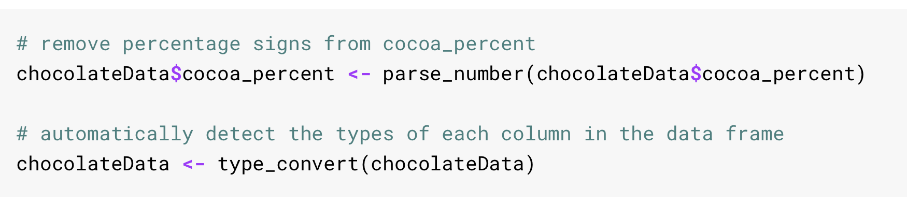
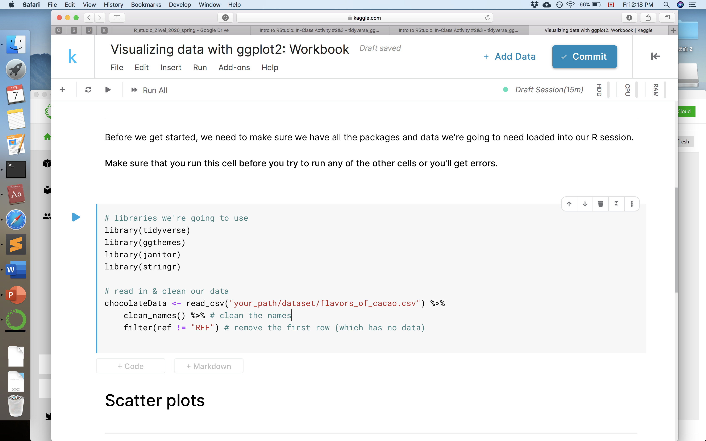
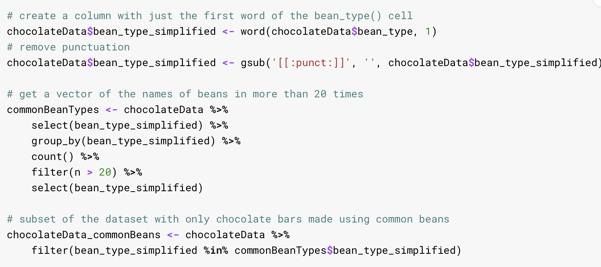

 
# ggplot2 & Data Visualization
If you and your group have any questions or get stuck as you work through this in-class exercise, please ask the instructor for assistance.  Have fun!

1. [Download this data](http://bit.ly/2wfjTx3){:target="_blank"} Note that you will use **flavors_of_cacao.csv** to finish your task below.

2. Go to [this online tutorial](http://bit.ly/2wjPo95){:target="_blank"} of **Visualizing data with ggplot2**

2.1 Read through the tutorial until **Making scatter plots** and finish the following in your RStudio

- set up your environment by typing below
- Make a scatter plot of the cocoa percentage (cocoa_percent) and the rating a chocolate bar received (rating).  Some code was written below to remove the percentage signs from the column cocoa_percent and to make sure the data type of each column is correct. 
- Your assignment is to make: 
      - A scatter plot …
      - with a line of best fit (hint: make sure you've set the method of geom_smooth() to "lm")...
      - and with informative x & y labels and a helpful title
      - You can also try adding labels with additional information on each bar, or plotting the year that the review was written in a different color.

2.2 Read through section **Making bar charts** and finish the following in your RStudio
- Let's make a bar plot that shows how often different types of beans are used to make chocolate bars in different countries. For this graph to be readable, we're going to have to do a bit of data cleaning first. 
- 
- Make a simple bar plot using the data frame, chocolateData_commonBeans.
- Your assignment is to make:  
      - a bar plot showing the count of bean_type_simplified in  the chocolateData_commonBeans data frame
      - color-coded bar plot of bean_type_simplifed, faceted by country

2.3 Read through section **Making line charts** and finish the following in your RStudio
- Let's use a line chart to show how the mean rating of chocolate bars has changed by year. Firstly, get the mean rating of chocolate bars per year by typing below
- 
- Your assignment is to make:  
       - Plot the change in rating by year using geom_line(). You can also add a fitted line if you like. 
       - Pick two different themes from the ggthemes package and apply them to your chart. One chart with a theme applied to it and another chart with a different theme applied to it.

Reference: [Racheal’s R Tutorial, Kaggle](https://www.kaggle.com/rtatman/rachael-s-r-tutorials){:target="_blank"}

[APPENDIX: ggplot2 Cheatsheet](https://drive.google.com/file/d/1PuMBZwAutnBjJ8xVCeLgElZwcC1UIhrz/view){: .btn .btn-purple } 
[NEXT STEPS: Earn a Workshop Badge](informal-credentials.html){: .btn .btn-blue }
