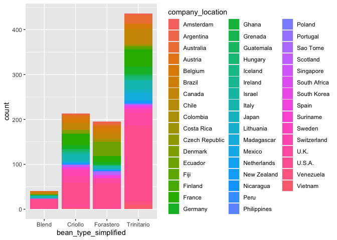

6-Data Visualization with ggplot2
================

- [1. Getting Ready](#1-getting-ready)
- [2. Creating Plots and Charts in
  ggplot2](#2-creating-plots-and-charts-in-ggplot2)
  - [2.1. Scatter Plots](#21-scatter-plots)
  - [2.2. Bar Charts](#22-bar-charts)
  - [2.3. Line Charts](#23-line-charts)

If you and your group have any questions or get stuck as you work
through this in-class exercise, please ask the instructor for
assistance. Have fun!

The `ggplot2` package is a popular system for creating data
visualizations like plots, charts, graphs, etc.

In this activity, you will make a scatter plot, bar chart, and a line
chart.

Before you start this activity, let's give your RStudio session a fresh start. For that:
- Save your previous scripts by clicking on File > Save, or on the save icon on the top left. If needed, choose a folder to save it (probably the working directory you were working on in the previous activity) and give it a meaningful name.
- Close the script by clicking on File > Close or on the x next to the file name on the top left.
- Clean your R environment (i.e., remove all the objects) by clicking on the broom icon  on the top right and clicking yes on the pop-up window that appears.
-  Create a new script by clicking on File > New File > R Script, or on the New Script icon  on the top left.

## 1. Getting Ready

### 1.1 Prepare your working environment

You will use both the `tidyverse` and the `janitor` package in this activity. You should already have the `tidyverse` package installed on your computer for previous activities, but not the `janitor` package. So before you continue, make sure to install the `janitor` package by running the following code in your console:

``` r
install.packages("janitor")
``` 

<div class="task-box" markdown="1">

⭐ <u>Task 6-1</u>

**Prepare your working environment.**

Prepare your working environment by loading the `tidyverse` and `janitor` packages (the `ggplot2` package is part of the tidyverse package) and setting your working directory.

{::options parse_block_html='true' /}
<details>
<summary>
Check your code
</summary>

``` r
# load packages
library(tidyverse)
library(janitor)

# set working directory
setwd("path-to-folder")
```
</details>

{::options parse_block_html='false'/}

</div>

### 1.2 Load your data

From [this
link](https://uviclibraries.github.io/rstudio/docs/flavors_of_cacao.csv){:target=“\_blank”}
download the following data we have prepared for you to use in this
activity. Save the file in your working directory.

<div class="task-box" markdown="1">

⭐ <u>Task 6-2</u>

**Read your data set.**

- Data set file name: `flavors_of_cacao.csv`
- Name your dataframe: `chocolateData`

{::options parse_block_html='true' /}
<details>
<summary>
Check your code
</summary>

``` r
# read data
chocolateData <- read.csv("flavors_of_cacao.csv")
```
</details>

{::options parse_block_html='false'/}

*Hint:* See Section 4 for instructions on importing a .csv file.

</div>

### 1.3 Check your data

<div class="task-box" markdown="1">

⭐ <u>Task 6-3</u>

**Preview the first 5 rows of your chocolate data.**

{::options parse_block_html='true' /}
<details>
<summary>
Check your code
</summary>

``` r
# Check data
chocolateData %>% head(5) # Preview first 5 lines of chocolateData
```

    ##    Company SpecificBeanOrigin_BarName  REF Review_Date Cocoa_Percent Company_Location Rating
    ## 1 A. Morin                Agua Grande 1876        2016           63%           France   3.75
    ## 2 A. Morin                      Kpime 1676        2015           70%           France   2.75
    ## 3 A. Morin                     Atsane 1676        2015           70%           France   3.00
    ## 4 A. Morin                      Akata 1680        2015           70%           France   3.50
    ## 5 A. Morin                     Quilla 1704        2015           70%           France   3.50
    ##   Bean_Type Broad.Bean_Origin
    ## 1                    Sao Tome
    ## 2                        Togo
    ## 3                        Togo
    ## 4                        Togo
    ## 5                        Peru

</details>

{::options parse_block_html='false'/}

</div>

Another way to inspect your data is to use the `str()` function presented in section 4.

<div class="task-box" markdown="1">

⭐ <u>Task 6-4</u>

**See the structure of your data.**

{::options parse_block_html='true' /}
<details>
<summary>
Check your code
</summary>

``` r
# Check data
str(chocolateData)
```
    ## 'data.frame':	1795 obs. of  9 variables:
    ##  $ Company                   : chr  "A. Morin" "A. Morin" "A. Morin" "A. Morin" ...
    ##  $ SpecificBeanOrigin_BarName: chr  "Agua Grande" "Kpime" "Atsane" "Akata" ...
    ##  $ REF                       : int  1876 1676 1676 1680 1704 1315 1315 1315 1319 1319 ...
    ##  $ Review_Date               : int  2016 2015 2015 2015 2015 2014 2014 2014 2014 2014 ...
    ##  $ Cocoa_Percent             : chr  "63%" "70%" "70%" "70%" ...
    ##  $ Company_Location          : chr  "France" "France" "France" "France" ...
    ##  $ Rating                    : num  3.75 2.75 3 3.5 3.5 2.75 3.5 3.5 3.75 4 ...
    ##  $ Bean_Type                 : chr  " " " " " " " " ...
    ##  $ Broad.Bean_Origin         : chr  "Sao Tome" "Togo" "Togo" "Togo" ...

</details>

{::options parse_block_html='false'/}

</div>

We can see that the dataset is composed of 1795 observations of chocolates, where 9 variables have been measured. The result also shows you the names of the variables and the type of each variable. With this type of result, you can identify certain elements of your dataset that you might want to clean before starting with data visualization and analysis.

In the above example, you can see that variable names do not have a standardized format such as all lower caps, or using "." or "_" instead of spaces. Moreover, you can see that the percent of cocoa in each chocolate was read as a character because it contains the % sign, but you might want to make this into numeric values for data analysis. Next, we will see simple ways to clean your data.

### 1.4 Clean your data

After checking your dataset, you might encounter some errors that you want to correct in your data. Cleaning your data and making sure that it is in good shape for data visualization and analysis is an important step. Here we will go through some basic data cleaning steps.

⭐ <u>Task 6-4</u>

**Standardize column names**

Use the `clean_names()` function from the janitor package to automatically standardize column names formatting. The `clean_names()` function requires only one parameter: the dataframe name.

*Hint:* Remember to overwrite `chocolateData` with the object with the new column names, otherwise R will not save the new column names.

{::options parse_block_html='true' /}
<details>
<summary>
Check your code
</summary>

``` r
## standardize column names
chocolateData <- clean_names(chocolateData)
## view column names after standardization
str(chocolateData)
```
    ## 'data.frame':	1795 obs. of  9 variables:
    ##  $ company                      : chr  "A. Morin" "A. Morin" "A. Morin" "A. Morin" ...
    ##  $ specific_bean_origin_bar_name: chr  "Agua Grande" "Kpime" "Atsane" "Akata" ...
    ##  $ ref                          : int  1876 1676 1676 1680 1704 1315 1315 1315 1319 1319 ...
    ##  $ review_date                  : int  2016 2015 2015 2015 2015 2014 2014 2014 2014 2014 ...
    ##  $ cocoa_percent                : chr  "63%" "70%" "70%" "70%" ...
    ##  $ company_location             : chr  "France" "France" "France" "France" ...
    ##  $ rating                       : num  3.75 2.75 3 3.5 3.5 2.75 3.5 3.5 3.75 4 ...
    ##  $ bean_type                    : chr  " " " " " " " " ...
    ##  $ broad_bean_origin            : chr  "Sao Tome" "Togo" "Togo" "Togo" ...

</details>

{::options parse_block_html='false'/}

</div>

**Fix percent values**

Remove the percentage signs from the column cocoa_percent by converting the values to numbers using the functions `mutate()` and `parse_number()`. The `parse_number()` function takes in as a parameter a vector and drops all the non-numeric characters, transforming it in a numeric vector.

Use the `clean_names()` function from the janitor package to automatically standardize column names formatting. The `clean_names()` function requires only one parameter: the dataframe name.

*Hint:* Remember to overwrite `chocolateData` with the object with the new column names, otherwise R will not save the new column names.

{::options parse_block_html='true' /}
<details>
<summary>
Check your code
</summary>

``` r
# cleans % from cocoa_percent
chocolateData <- chocolateData %>% # get the dataframe
  mutate( # identified that you want to "mutate" a variable
    cocoa_percent = parse_number(cocoa_percent) # overwrite cocoa_percent variable after having used the parsed_number function
  )
## view data frame after cleaning. Note how the cocoa_percent variable is now nueric
str(chocolateData)
```
    ## 'data.frame':	1795 obs. of  9 variables:
    ##  $ company                      : chr  "A. Morin" "A. Morin" "A. Morin" "A. Morin" ...
    ##  $ specific_bean_origin_bar_name: chr  "Agua Grande" "Kpime" "Atsane" "Akata" ...
    ##  $ ref                          : int  1876 1676 1676 1680 1704 1315 1315 1315 1319 1319 ...
    ##  $ review_date                  : int  2016 2015 2015 2015 2015 2014 2014 2014 2014 2014 ...
    ##  $ cocoa_percent                : num  63 70 70 70 70 70 70 70 70 70 ...
    ##  $ company_location             : chr  "France" "France" "France" "France" ...
    ##  $ rating                       : num  3.75 2.75 3 3.5 3.5 2.75 3.5 3.5 3.75 4 ...
    ##  $ bean_type                    : chr  " " " " " " " " ...
    ##  $ broad_bean_origin            : chr  "Sao Tome" "Togo" "Togo" "Togo" ...

</details>

{::options parse_block_html='false'/}

</div>

------------------------------------------------------------------------

📍 Reminder! Save your work

------------------------------------------------------------------------

## 2. Creating Plots and Charts in ggplot2

Here is some information about creating and formatting plots, common to
all types we will look at in this activity. Don’t do anything yet!

The command to begin plots and charts are very similar. Let’s first look
at the commonalities. For all of them, we will use the `ggplot()`
function and a geometry function. `ggplot()` parameters are:

- The dataset used for the plot `data = datasetName`
- The aesthetic mappings. This specifies which column values is assigned
  to the x axis, and which is assigned to the y axis.
  - `aes(x = columnForXAxis, y = columnForYAxis)`

The geometry function is attached to the ggplot() function with
`+ geom_` and is completed by the type of plot or chart:
- scatter plot or point plots: `+ geom_point()`
- bar charts: `geom_bar()`
- line charts: `geom_line()`

Plots will appear in the “Plot” tab (probably in the bottom right hand
quadrant of your workspace).

### 2.1. Scatter Plots

Let’s apply the ggplot command above to create a scatter plot. <br>

**Definition - Scatter plot:** A plot with two axes, each representing a
different variable. Each individual observation is showing using a
single point. The position of the point is determined by the value of
the variables assigned to the x and y axes for that observation.


------------------------------------------------------------------------

📍 Reminder! Save your work

------------------------------------------------------------------------

<div class="task-box" markdown="1">

⭐ <u>Task 2.1-1</u>

**Make a scatter plot of the cocoa percentage and the rating a chocolate
bar received.**

- Using chocolate data : `chocolateData`
- X-axis = Cocoa percentage: `cocoa_percent`
- Y-axis = Rating a chocolate bar received: `rating`

{::options parse_block_html='true' /}
<details>
<summary>
Check your code
</summary>

``` r
ggplot(data = chocolateData, aes(x = cocoa_percent, y = rating)) +
    geom_point() # then add a layer of points
```


</details>

{::options parse_block_html='false'/}

</div>

<br> Before we add details to our plot, we need to learn about the
different components. Again, wait until the next task to do anything.

**Definition - Fitted line:** (aka. a ‘line of best fit’) is a line
representing some function of x and y that has the best fit (or the
smallest overall error) for the observed data. <br>

Function for adding a smooth line to a plot: `geom_smooth(method = "")`

- method type specifies the type of smoothing to be used

<details markdown ="1">
<summary>
Expand for more geom_smooth method types
</summary>

- *Linear Model (“lm”):* fits a linear regression model, suitable
for linear relationships.
- *Locally Estimated Scatterplot Smoothing (“loess” or “lowess”)*: creates
a smooth line through the plot by fitting simple models in a localized
manner, which can handle non-linear relationships well. Ideal for
smaller datasets
- *Generalized Additive Models (“gam”):* model complex, nonlinear trends
in data.Ideal for larger datasets.
- *Moving Average (“ma”):* smooths data by creating an average of
different subsets of the full dataset. It’s useful for highlighting
trends in noisy data.
- *Splines (“splines”):* provide a way to smoothly interpolate between
fixed points, creating a piecewise polynomial function. They are useful
for fitting complex, flexible models to data.
- *Robust Linear Model (“rlm”):* Similar to linear models but less
sensitive to outliers. It’s useful when your data contains outliers that
might skew the results of a standard linear model.

</details>

<br>

- Fitted line: `method = "lm"`

<div class="task-box" markdown="1">

⭐ <u>Task 2.1-2</u>

**Make another scatter plot of the cocoa percentage and the rating a
chocolate bar received**, with the following:

- A “line of best fit”

Remember:
- Using chocolate data: `chocolateData`
- X-axis = Cocoa percentage: `cocoa_percent`
- Y-axis = Rating a chocolate bar received: `rating`
- Line of best fit: `geom_smooth(method = "lm")`

{::options parse_block_html='true' /}
<details>
<summary>
Check your code
</summary>

``` r
ggplot(data = chocolateData, aes(x = cocoa_percent, y = rating)) +
  geom_point() + # then add a layer of points
  geom_smooth(method = "lm")
```

    ## `geom_smooth()` using formula = 'y ~ x'


</details>

{::options parse_block_html='false'/}

</div>

<div class="task-box" markdown="1">

⭐ <u>Task 2.1-3</u>

**Add descriptive axis labels and a title to your scatter plot.**

We’re also going to add labels and custom colors using the `labs()`
function and custom colors.

- Labels `+ labs(title = "", x = "", y = " ")`

{::options parse_block_html='true' /}
<details>
<summary>
Check your code
</summary>

``` r
# you can use the following labels or make your own.
ggplot(data = chocolateData, aes(x = cocoa_percent, y = rating)) +
  geom_point() + # then add a layer of points
  geom_smooth(method = "lm") + 
  labs(title = "Rating of Chocolate Bar by Cocoa Percentage", x = "Chocolate Bar Rating", y = "Cocoa Percentage")
```

    ## `geom_smooth()` using formula = 'y ~ x'


</details>

{::options parse_block_html='false'/}

</div>

### 2.2. Bar Charts

First things first, we need to quickly clean up our dataframe for bar
charts. Copy and paste the following code into your console, and
execute. <br>

``` r
chocolateData <- chocolateData %>%
# A few steps to clean the bean type variable
  mutate(
    bean_type_simplified = word(bean_type, 1), # get just the first word
    bean_type_simplified = gsub('[[:punct:]]', '', bean_type_simplified), # reove punctuations
    bean_type_simplified = trimws(bean_type_simplified) # remove white spaces
  ) %>%
  filter(str_detect(bean_type_simplified, "\\S")) # This ensures the string contains at least one non-whitespace character

# Get the most common bean types
commonBeanTypes <- chocolateData %>%
  select(bean_type_simplified) %>%
  group_by(bean_type_simplified) %>%
  count() %>%
  filter(n > 20) %>%
  ungroup() %>%
  mutate(bean_type_simplified = as.factor(bean_type_simplified))


# Filter chocolateData to only include common beans
chocolateData_commonBeans <- chocolateData %>%
  filter(bean_type_simplified %in% commonBeanTypes$bean_type_simplified)
```

<br>

A bar chart illustrates *categories* along the x-axis and the count of
observations from each category on the y-axis.

To make a bar chart, you need the data (categories, and values relevant
to those categories), and the categories the data will be separated by
(each representing one bar).

The first 5 rows of the dataframe filtered for the common bean types:

    ## # A tibble: 5 × 10
    ##   company_maker_if_known specific_bean_origin_…¹   ref review_date cocoa_percent
    ##   <chr>                  <chr>                   <dbl>       <dbl>         <dbl>
    ## 1 A. Morin               Carenero                 1315        2014            70
    ## 2 A. Morin               Sur del Lago             1315        2014            70
    ## 3 A. Morin               Puerto Cabello           1319        2014            70
    ## 4 A. Morin               Madagascar               1011        2013            70
    ## 5 A. Morin               Chuao                    1015        2013            70
    ## # ℹ abbreviated name: ¹​specific_bean_origin_or_bar_name
    ## # ℹ 5 more variables: company_location <chr>, rating <dbl>, bean_type <chr>,
    ## #   broad_bean_origin <chr>, bean_type_simplified <chr>

The bars will represent the following categories:

    ## # A tibble: 4 × 2
    ##   bean_type_simplified     n
    ##   <fct>                <int>
    ## 1 Blend                   41
    ## 2 Criollo                213
    ## 3 Forastero              195
    ## 4 Trinitario             436

With the code above, you now have:

- A dataset `chocolateData_commonBeans`: containing the chocolate bars
  made with the most common beans
- A variable `bean_type_simplified`, which lists the types of beans to
  be used as the categories for the x-axis.

The call for bar charts in ggplot2 `geom_bar` makes the height of the bar 
proportional to the number of observations in each group of a categorical
variable, so you only need to tell ggplot2 the variable you want to use for
the bar chart, and it makes the calculations in the background.

<div class="task-box" markdown="1">

⭐ <u>Task 2.2-1</u>

**Create a basic bar chart.**

Your chart will illustrate the numbers of bars of different types of the most
common bean types that are being made.

{::options parse_block_html='true' /}
<details>
<summary>
Check Your Code and Output
</summary>

``` r
ggplot(chocolateData_commonBeans, aes(x = bean_type_simplified))+
  geom_bar()
```

Output:


</details>

{::options parse_block_html='false'/}

*Hint:* geom type = “bar”

</div>

A stacked bar chart shows two dimensions (variables) of data. Each bar
will represent one variable, and each bar will be chopped into sections
which represent a second variable.

<div class="task-box" markdown="1">

⭐ <u>Task 2.2-2</u>

**Create a stacked bar chart.**

To add a second dimension,

- following the same command as the bar chart above, modify it by:
  - adding the parameter `fill = factor2name` to `aes()`, where
    ‘factor2name’ is the second variable’s column name.
  - setting the parameter of `geom_bar()` to `position="stack"`
 
For this task, use `company_location` as the second variable that will
chop the bars into sections.

{::options parse_block_html='true' /}
<details>
<summary>
Check Your Code and Output
</summary>

``` r
ggplot(chocolateData_commonBeans, aes(x = bean_type_simplified, fill = company_location)) +
  geom_bar(position = "stack")
```

Output:

</details>

{::options parse_block_html='false'/}

</div>

<br> **Definition - facets:** A way of breaking apart a plot of a
specific data frame so that each level of a the target factor is shown
in a separate, smaller chart. <br> A faceted bar chart is like a grid of
mini bar charts, each showing a different slice of the data side by side
for comparison.

We can facet a bar chart in a few different ways.

- Where the previous bar chart has one piece of information in each bar,
  we will now add two.

  - Instead of `aes(x=)` representing just the categories that each bar
    will represent, we will add a `fill=` parameter for the subgroups of
    each column.
  - `ggplot(data, aes(x = category, fill = subgroup))`

- We will then add
  `+ geom_bar(position = "fill") + facet_wrap(~facet_variable)`

- `geom_bar()` creates a stacked bar chart with proportions

  - ‘fill’ means that each proportion of the bar will total to 100%

``` r
ggplot(chocolateData_commonBeans, aes(x = chocolateData_commonBeans$bean_type_simplified)) + geom_bar(position = "fill") + facet_wrap(~facet_variable)
```

### 2.3. Line Charts

To create a line chart, let's start first by creating a new variable that we
might want to plot in a line chart. In this case, let's assume we are interested
in seeing how the average chocolate rating varies through the years.

<div class="task-box" markdown="1">

⭐ <u>Task 2.3-1</u>

**Create an object with the mean chocolate rating by year.**

Using piping, create a new object, `meanRatingByYear`

- base data: `chocolateData`
- group_by: `review_date`
- use `summarise()`
  - the parameter is `rating=mean(rating)`

{::options parse_block_html='true' /}
<details>
<summary>
Check Your Code
</summary>

``` r
meanRatingByYear <- chocolateData %>%
                        group_by(review_date) %>%
                        summarise(rating = mean(rating))

# Now see the object created
meanRatingByYear 
```

Your output will be:

    ## # A tibble: 12 × 2
    ##    review_date rating
    ##          <dbl>  <dbl>
    ##  1        2006   3.28
    ##  2        2007   3.30
    ##  3        2008   3.05
    ##  4        2009   3.13
    ##  5        2010   3.20
    ##  6        2011   3.27
    ##  7        2012   3.21
    ##  8        2013   3.28
    ##  9        2014   3.24
    ## 10        2015   3.28
    ## 11        2016   3.26
    ## 12        2017   3.5 

</details>

{::options parse_block_html='false'/}

Then convert “review_date” to Date class by entering

``` r
meanRatingByYear$review_date <- as.integer(meanRatingByYear$review_date)
```

</div>

Now we are ready to make our line chart!

<div class="task-box" markdown="1">

⭐ <u>Task 2.3-2</u>

**Create a line chart using the mean chocolate rating by year.**

Here we’ll make a line chart to show how the mean rating of chocolate
has changed by year.

- Your base data will be the mean rating table you just created
- the x-axis value will be the review date
- the y-axis will be the rating
- the geom type is `line`, with no parameter

After the geom type, you might want to add a line of code to make sure the
x-axis label contains the actual years. For that, you can use the `scale_x_continuous` function, which take as the parameter `breaks` the
vector of points to create axis breaks. To use the function, you have to use 
`+ scale_x_continuous(breaks = vectorofbreaks)` at the end of your plot code.

{::options parse_block_html='true' /}
<details>
<summary>
Check Your Code
</summary>

``` r
ggplot(meanRatingByYear, aes(x = review_date, y = rating)) +
  geom_line()+
  scale_x_continuous(
    breaks = meanRatingByYear$review_date  # Use actual review dates for breaks
  )
```

Output:


</details>

{::options parse_block_html='false'/}

</div>

<div class="task-box" markdown="1">

⭐ <u>Task 2.3-3</u>

**Style your line chart.**

Using the same chart you just made, add some stylistic features and
modifications.

- rename the x label to “Review Date”
- rename the y label to “Rating”
- Add a title using `ggtitle()` : “Change in Rating Over Time"

{::options parse_block_html='true' /}
<details>
<summary>
Check Your Code
</summary>

``` r
ggplot(meanRatingByYear, aes(x = review_date, y = rating)) +
  geom_line() +
  scale_x_continuous(
    breaks = meanRatingByYear$review_date  # Use actual review dates for breaks
  ) +
  labs(
    x = "Review Date", 
    y = "Rating", 
    title = "Change in Rating Over Time"
  ) 
```

<br> Output:


</details>

{::options parse_block_html='false'/}

</div>

------------------------------------------------------------------------

📍 Reminder! Save your work

------------------------------------------------------------------------

<script>  
function toggle(input) {
    var x = document.getElementById(input);
    if (x.style.display === "none") {
        x.style.display = "block";
    } else {
        x.style.display = "none";
    }
}
</script>
<style>
details {
    background-color: lightgray; 
    padding: 10px;
    margin: 5px;
    border-radius: 5px;
}
.task-box {
      border: 1.5px solid #ccc;
      padding: 10px;
      margin: 10px 0;
      border-radius: 5px;
      background-color: #f5f2f6;
  }
  &#10;</style>
<!--https://gist.github.com/rxaviers/7360908-->

[Earn a workshop badge](informal-credentials.html){: .btn .btn-blue }
