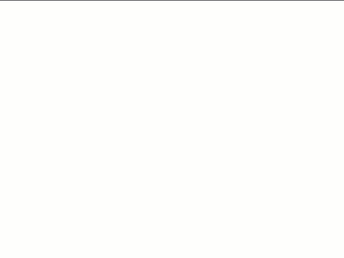

# Data Manipulation with Tidyverse

If you and your group have any questions or get stuck as you work through this in-class exercise, please ask the instructor for assistance.  Have fun!

1. Installing Packages: One of the most fascinating things about R is that it has an active community developing a lot of packages everyday, which makes R powerful. A package is a compilation of functions (datasets, code, documentations and tests) external to R that provide it with additional capabilities.  
- Type <code>install.packages("tidyverse")</code> to install this package.
- Type <code>library(tidyverse)</code> to load it. You only need to install a package once, but you need to reload it every time you start a new session.

2. [Download various data here](http://bit.ly/2wfjTx3){:target="_blank"}. Note that you will use this file: [**histopaths.csv**](docs/histopaths.csv) to finish your task below.

3. Go to [this online tutorial](http://bit.ly/2TVOLMO){:target="_blank"} of manipulating data with Tidyverse
- Read through **Section 1: Get our workspace ready** and finish the following in your R Studio
- load in tidyverse: <code>library(tidyverse)</code>
- read in your dataset **histopaths.csv** as musselData (Click the **Files** tab in the lower right panel. Navigate to the **histopaths.csv** file, then click on this file, and click **Import Dataset**. In the pop-out window, change the dataset’s name to **musselData**, then click **Import**)

<button onclick="toggle('gif1')">Show/Hide Animation</button>

        
     

- look at the first couple of rows of musselData - hint: <code>head()</code>
- get the dimensions of your dataset - hint: <code>dim()</code>  

<button onclick="toggle('gif2')">Show/Hide Animation</button>

        
     

       

3.2 Read through **Section 2: Piping** and finish the following in your R Studio (Please ask the instructor for assistance if you get stuck)
- use pipes (%>%) to get a list of all the column names in musselData 
- sort them alphabetically 

3.3  Read through **Section 3: Selecting specific columns** and finish the following 
- select all the columns from musselData that start with "cestode" (hint: starts_with())
- select all the columns from musselData that do *not* start with "cestode"

3.4  Read through **Section 4: Selecting specific rows** and finish the following 
- filter all the rows from musselData where abnormality is greater than 3
- filter all the rows from musselData where coastal_ecological_area is "Lake Michigan"
- filter all the rows from musselData where sex is "Male" and state_name is "Mississippi"

3.5  Read through **Section 5: Creating new variables with mutate** and finish the following 
- add a new variable called **large_mussels** that is TRUE if a mussel is over 10 oz. (hint: wet_weight > 10)
- add a new variable parasites that is TRUE if a mussel has more than 1 unidentified_organism in it and a wet_weight of less than 0.5 oz

3.6  Read through **Section 6: Sorting data with arrange** and finish the following 
sort the musselData data frame so that the longest mussels are first (hint: variable "length") 

3.7  Read through **Section 7: Summarizing variables with summarize** and finish the following 
- use summarize() to create a single data frame with the mean and median length

3.8  Read through **Section 8: Analyzing groups with group_by** and finish the following 
- group by state_name and summarize the length of mussels by state
- summarize length by the coastal_ecological_area

[NEXT STEP: Data Visualization with ggplot2](ggplot2-data.html){: .btn .btn-blue }
