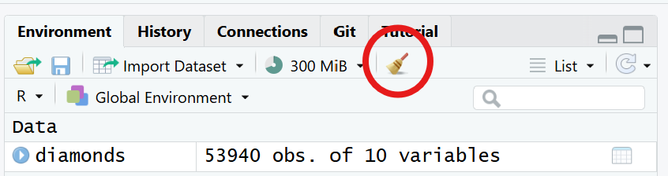
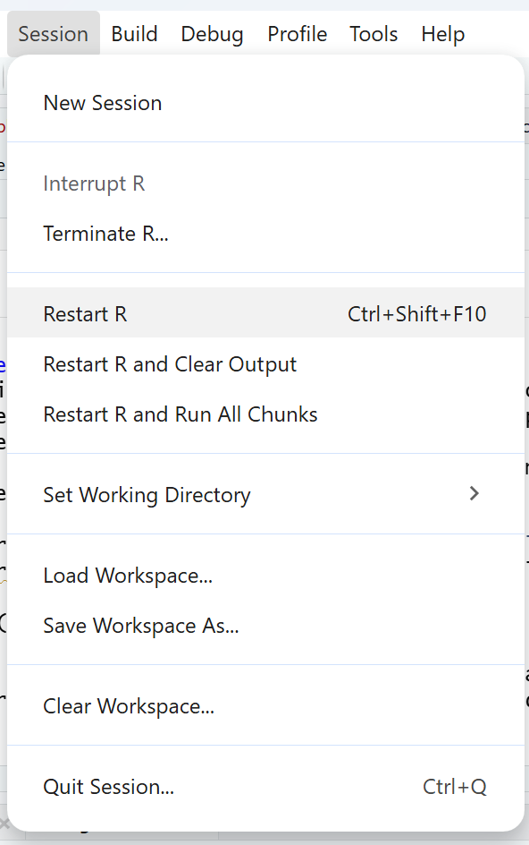
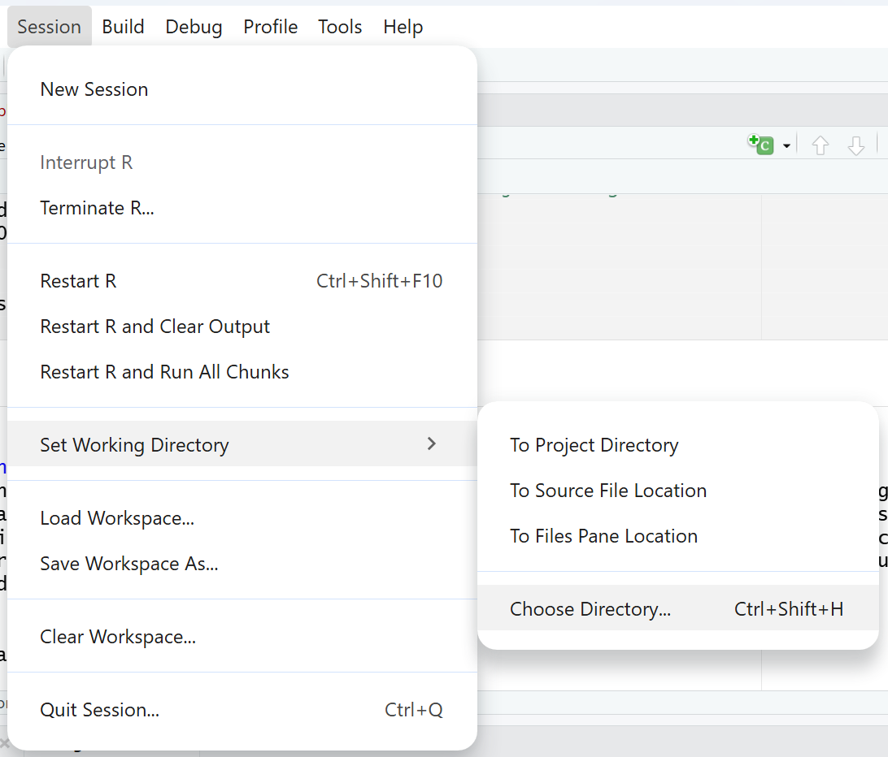

```{r include = FALSE}
knitr::opts_chunk$set(
  error = TRUE# print error message and do not interrupt in case of errors
)
```
# Troubleshooting in R

- [Common strategies to troubleshoot](#common-strategies-to-troubleshoot)
- [Common mistakes](#common-mistakes)

Every one who uses R, beginner or advanced, faces errors in their code. In fact, learning how to read errors messages and troubleshoot them is one of the most important aspects of learning R. This page goes over some good strategies to troubleshoot and some of the most common mistakes. You can refer back to this page whenever you face a problem to help you troubleshoot it. 

## Common strategies to troubleshoot

### Keep calm and read the error message
The first thing to do when your code is not working is to read the error message. As frustrating as it can be to see an error message, they are in fact there to help you identify what the mistake was. For example, let's look at the error message below:

```{r}
# Create an object with values
values <- c(1, 2, 3, 4, 5)

# Calculate the mean of these values
mean(value)
```

Instead of outputting the mean value, R is saying that the object `value` was not found. This might create confusion at first, as you would think you just created the object in the line above. But if R is not finding the object, you more likely did not create it. A close inspection shows that you created the object `values`, not `value`. This is a simple typo that can be easily fixed:

```{r}
# Create an object with values
values <- c(1, 2, 3, 4, 5)

# Calculate the mean of these values
mean(values)
```
Sometimes errors messages are more complicated than this, for example:

```{r, warning = FALSE, message=FALSE}
# Load package
library(tidyverse)

# Create vector of values
values <- c(1, 1, 2, 2, 3, 3)

# Identify unique set of distinct values
distinct(values)
```

Here, the error message might seem a bit daunting, but if you read with care, you can identify that R is telling you that it can not use the function `distinct` to an object of the type `double` or `numeric` (which your vector `values` is). This might prompt you to open the help of the function (see item 3 below), where you will see that the `distinct()` function takes a `data.frame` as its first argument, and not a vector. This is why this code is failing. You might then remember that the function `unique()` is the one you wanted to use, which does the same but for vectors:

```{r}
# Load lpackage
library(tidyverse)

# Create vector of values
values <- c(1, 1, 2, 2, 3, 3)

# Identify unique set of distinct values
unique(values)
```

There are numerous potential error mssages and the point there is not to go throught them all, but to show you that errors messages can be very helpful to identify what the error is.

### Double-check your code
After reading the error message and identifying what the mistake likely is, double-check your code with attention. Most errors are usually caused by simple typos or forgotten closing brackets in the code (see list of common mistakes below).

### Read function and package help

If you are facing an error when using a particular function, it is always helpful to open the documentation for the that function. To do that, you can run `help(function_name)` or `?function_name` in the console. Depending on the configurations of your RStudio, you can also open the help function by typing its name (in the code editor or console), and then hitting the button F1.

Once you do that, the documentation for the function will open on the bottom right panel of your RStudio Interface, as long as you have loaded the package that the contains the function.

For example, let's try opening the help for the `distinct()` function that we attempted to use above:
```{r, eval=FALSE}
?distinct
```

The help page will contain all or some of the following sections:
- **Description*: a brief description of what the function does
- **Usage**: the code to use the function, showing arguments and their default values
- **Arguments**: a detailed description of each argument, including what type of object is expected
- **Details**: any important details about the function
- **Value**: a description of the object returned by the function
- **Methods**: specific methods for different object types, if applicable
- **See Also**: related functions that might be useful
- **Examples**: examples of how to use the function

In the `distinct()` function help, you can see under "Arguments" that the argument `.data` expects "A data frame, data frame extension (e.g. a tibble), or a lazy data frame (e.g. from dbplyr or dtplyr).". That is why we could not use the function on a vector.

Besides function documentation, R packages also contain useful documentation. Many packages have `vignettes`, which are extended explanation of how to use the package, often including examples of how to use the functions in the package. You can assess the `vignette` by searching for the package webpage or typing `vignette("vignette-name")` in the console.

### Run one line at a time
We often run multiple lines of code together to perform an operation, but when an error message appear, we might not know in which line the error is. It it thus good rpactice to run each line at a time to find an error.

For example, this code results in an error:
```{r}
# This loads the built-in dataframe diamonds
data(diamonds)

diamonds %>% 
  mutate(price200 = price - 200, 
         price20perc = price * .80) %>%
  group_by(cut, color) %>% 
  summarize(total = count(), 
            m1 = mean(price), 
            m2 = mean(price200), 
            m3 = mean(price20perc)) %>% 
  ungroup()
```

The error message already suggest that the error was in the `summarize()` function, but lets run each line of code to check:

```{r}
diamonds
```
This executes correctly, that is, the obejct exists!

```{r}
diamonds %>% 
  mutate(price200 = price - 200, 
         price20perc = price * .80)
```
The use of the mutate function to calculate to new variables also seems to be working
```{r}
diamonds %>% 
  mutate(price200 = price - 200, 
         price20perc = price * .80) %>%
  group_by(cut, color)
```

The grouping function also seems to be working

```{r}
diamonds %>% 
  mutate(price200 = price - 200, 
         price20perc = price * .80) %>%
  group_by(cut, color) %>% 
  summarize(total = count(), 
            m1 = mean(price), 
            m2 = mean(price200), 
            m3 = mean(price20perc))
```

A-ha, there seems to be an error here! Once you know where the errors is, you can then more easily troubleshoot it. In this case, the problem is that the function `count()` cannot be used inside `summarize()`, but the function `n()` will work:


```{r, message = FALSE}
diamonds %>% 
  mutate(price200 = price - 200, 
         price20perc = price * .80) %>%
  group_by(cut, color) %>% 
  summarize(total = n(), 
            m1 = mean(price), 
            m2 = mean(price200), 
            m3 = mean(price20perc)) %>%
  ungroup()
```

### Restart R session
When we are actively writing code, it is common to test out possibilities, which often require creating test objects, reordering lines of code, and loading new packages. In this process, sometimes we accidentally overwrite an object and load a package that masks a function we are using. An easy to make sure you didn't do this is to clear your working environment of all objects, restart your R session, and then rerun the entire script.

To clear the working environment, you can run `rm(list =ls())` in your console, or click the "Clear objects from workspace" button in the top right. This will remove all objects.



To restart your R session, click on Session at the top, and then on Restart R. This will remove any loaded packages. When rerunning your script again, R will load only the packages that you wrote in your script, so make sure your script loads any packages you need.



### Look for similar errors online
Chances are, someone already ran into an error similar to yours. A quick online search often redirects you to a forum such as StackOverflow where someone already posted a question similar to yours and probably got an answer. When doing this online search, it is often helpful to search using specific terminology such as : the action you want to perform, the language you are using, and the specific style/tecnique you are using. For example, you could search: how to rename a column (i.e. the action) in R (i.e. the language) using the tidyverse (i.e. the style/technique of coding).

You might have noticed that, up until now, there was no mention of AI. That is because we encourage you to try to troubleshoot your errors by yourself, which is the best way to learn how to use R. However, AI can also be used adequately to help you troubleshoot, as long as you are not using AI as a way to avoid learning what the error was. For example, instead of pasting your problematic code and asking AI to fix it without understanding what went wrong, you could ask AI what an error message is referring to, or ask it to find typos in your code without editing your code.

### Take a break
Sometimes, the best way to troubleshoot an issue in R is just to take a break and come back later with a fresh mindset. Errors can be frustrating and the frustation and anger can prevent you from finding simple mistakes. Taking a break and coming back later usually works to find those mistakes.

### Ask someone for help
As has been said, the best way to learn is to try to troubleshoot the error by yourself. However, if that does nto work, you can always ask for help, both in forums in the internet, or to someone you know who might be a more advanced R user. If you are posting on a particular forum such as StackOverflow, don't forget to read [their guidelines](https://stackoverflow.com/help/how-to-ask) about how to post a question.

## Common mistakes

Here is a list of common mistakes all R users do. IF you are facing a problem in your code, going through these is probably a good start to try to figure out what can be happening in your code.

### Capitalization

You typed a lower-case when it should have been an upper-case, or vice-versa. R is case-sensitive so this will result in an error for functions and objects. For example, calling `Mean()` won't run and result in an error code as the name of the function is `mean()`, all lower caps. Or you named the object `MyData` when you first created it but then later is calling the object `mydata`.

### Misspelling

You misspelled a function name or an object name. R Studio does not highlight spelling errors in code like in Microsoft Word, so you have to pay attention to this when typing. For functions and arguments that have both British and American spelling (e.g. colour/color), R accepts both versions.

### Closing punctuation

Your forgot to close a parenthesis, curly bracy, square bracket, or quotation mark. You will know that this is happening because R will expect additional code to continue, so the console will show a `+` instead of `>`. You will also see a red X on the left side of the line in the code editor.

Alternatively, instead of not including a closing punctuation, you might have added it to the wrong location. The code might even run, but the results will be weird, or an error message will appear. For example, to get the average of a list of numbers going from 1 to 100 in steps of 5 you would write `mean(seq(1, 100, by = 5))`. However, if you write: `mean(seq(1, 100), by = 5)` (note the closing parenthesis before the `by` argument instead of after), the code will run, but the result is wrong.

### Continuing punctuation
You forgot to add a comma or a pipe before moving on to the next indented line. Indenting lines makes the code easier to read, but it can be easy to forget a comma or a pipe. For example:
```{r}
diamonds %>% 
  mutate(price200 = price - 200 # missing comma
         price300 = price - 300) # missing pipe
  select(cut, price) %>%
  arrange(price)
```

```{r}
diamonds %>% 
  mutate(price200 = price - 200, ## added comma
         price300 = price - 300) %>% # added pipe
  select(cut, price) %>%
  arrange(price)
```


### Open pipe
You accidentally left an open pipe at the end of a line. If there are no lines of code after, you will note this because the console will show a `+` instead of `>`. However, if you have other code after, R will continue to run the code and it will shown an error, for example:
```{r}
# Calculate and get new variables
diamonds2 <- diamonds %>% 
  mutate(price200 = price - 200,
         price300 = price - 300) %>% 
  select(cut, price200, price300) %>% # forgotten open pipe

# another piece of code after
mean(diamonds2$price200)
```
To correct:
```{r}
# Calculate and get new variables
diamonds2 <- diamonds %>% 
  mutate(price200 = price - 200,
         price300 = price - 300) %>% 
  select(cut, price200, price300) # removed pipe

# another piece of code after
mean(diamonds2$price200)
```
### Overwritting objects
You accidentally overwrote an object that you needed. This might be written in the code editor, or you might have done that in your console without noticing it. A good way to check is to always preview the objects you are using to make sure they are what you want them to be. For example, you can use `head()` to preview the first rows of a dataframe to amke sure they look like how they should, or even ask R what type of object it is with `class()`.

### Not assigning objects
You did not save an object that you wanted to save. This is very common at the beginning, when you are still not used that you need to assign data to an object using `<-` so that R can save the object in the workspace and use it later.

For example, imagine you had this piece of code
```{r}
# Calculate and get new variable about price
diamonds %>% 
  mutate(price100 = price - 100)

# another piece of code after
mean(newdiamonds$price100)
```

Because you never saved the calculation of the new variable into a new object, R cannot find it to calculate the mean. This is the corrected piece of code:
```{r}
# Calculate new variable about price, and assign to new object using <-
newdiamonds <- diamonds %>% 
  mutate(price100 = price - 100)

# another piece of code after, using the new object
mean(newdiamonds$price100)
```

### Wrong working directory
You are using the wrong working directory. The working directory is the folder R is looking at to search for files you want to upload. However, if you forgot to specify the working directory (or specified a wrong one), R will not be able to find the files you are trying to upload. a quick way to check your working directory is to run `getwd()` in your console. If the directory is wrong, you can use `setwd()` to set the correct directory or click on Session > Set Working Directory > Choose Directory.



### Package not loaded
The package you want is not loaded. It is important to make sure all the relevant packages are loaded. Whenever you close R, the packages are unloaded, so you need to load your packages every time you open R. A typical sign that this is an mistake is if the error message reads that a certain function could not be found.

### Function masked by other packages
You are using a function that is masked by another a package. What does this mean? Sometimes, different packages have functions with the same name. When that happens, R will use the functions from the package that was more recently loaded. This is called "masking". If you want to use the function from the other package, but R is using the function from the most recent package, the code will probably break due to different arguments. The error message will say something indicating that you have a wrong argument or your usage of the function is wrong. 

When you suspect that, a good way to investigate further is to call the help of the function and check to which package it belongs too. Packages are shown on the top left of the help documentation, between {} after the function name. You can then see if the package is the one you intend to use.

Another way is to pay attention to messages that appear when loading the packages. If the loaded package is masking a function, you will see a message that says: "The following object is masked from 'package:xxx : function_name'". You then know to pay attention to masking when using those functions.

If you want to use the function from the other package, you need to specify that by using `package::function()`. For example, the `tidyverse` has a function called `filter()`, which masks a function of the same name from the base `stats` package. If you want to use the package from the `stats` package, you can specify: `stats::filter()`.

### Wrong package version
You package version does not work with your R version. From time to time, both base R and packages are updated. If you haven't worked in your code for a while and have updated base R since, you might find that the version of the package that you have is not in sync with the version of R. Or sometimes the opposite happens, you downloaded a package that is for a newer version of R that you currently have. Sometimes this will not cause any issues, but it might cause some functions to stop working.

This is detected when loading a package. You will see a warning message that says: "package ‘package_name’ was built under R version X.X.X". you can then run `getRversion()` in your console to check if your version of R is newer or older than the package.

If you need to update R, you can simply just re-install R from the CRAN website.

If you need to update the package, the easiest thing is to re-install the package using `install.packages()`.

[NEXT STEP: Additional Resources](additional-resources.html){: .btn .btn-blue }